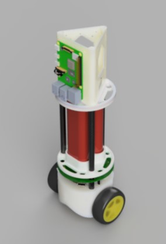
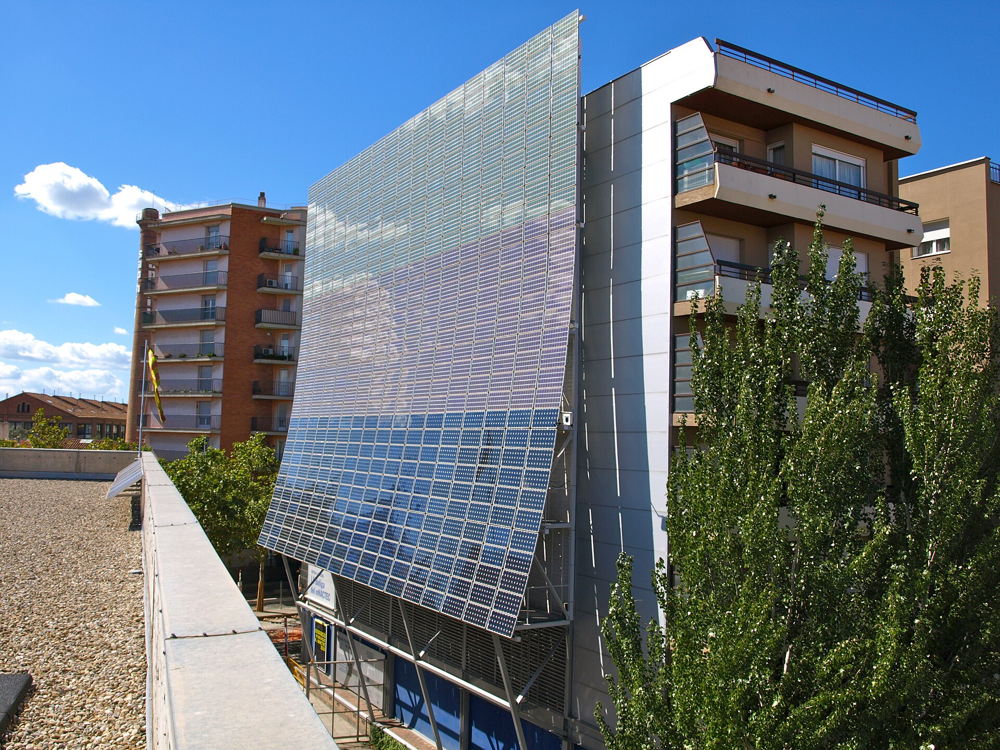

# EEE2/EIE2 Electronics Design Project

## Outline

The Electronics Design Project is a EEE2 and EIE2 module that runs in the Summer Term. It begins with a breifing, which follows the final written exam in May, and it ends with a demo and interview assessment near the end of the term. Students work in groups of six to design and implement a system that meets some high-level objectives. There is a choice of three topics for the project.

Most of the study time for the project is self-organised. You will need to plan your work from requirement elaboration and design decision exploration through to system integration and documentation. A series of talks is organised to help you with non-technical aspects.

### Project Groups

Project groups may be self-selected.
Your group must contain at least two students from the EEE programme and two from the EIE programme.
You may register a group of four, five or six members, but if you register fewer than six members it is possible that others will be added to your group.
It is also possible that groups of four will be broken up if there is no-one available to join the group.
There may be some groups of five due to division of the cohort.

Each project option can only support a limited number of groups, so you will need to rank your option preferences.
If an option is oversubscribed for first preferences, then some groups will be allocated to their second choice.

If you do not have a self-selected group then you may also submit preferences as an individual, which will be considered when allocating you to a group.

### Common Project Aims

All three projects share some common aims. They all require the design and implementation of a system made up of modular elements and interfaces between them.
The project topics are designed to draw on different areas of the EEE and EIE curricula, so that a collaborative approach is needed, drawing on different disciplines and skills.
Not every challenge in the project will be familiar and you will need to conduct independent research and apply general problem solving techniques to work towards the project requirements.
Some solutions may require the specification and purchasing of additional components, for which a budget is provided.
Finally, every project will draw upon various non-technical skill areas, including project planning and management, communication and teamworking.

## Project Options

The three project options are intended to build upon elements of both the EEE and EIE programmes.
Each of the project options contains elements that are suited to students from your stream.

### Option: Balance Robot

The aim of this project is to build a demonstrator robot that can balance on two wheels.
You should choose an application for the robot that will demonstrate interaction with human users or the environment.
A robot platform is provided, which contains wheels, motors, batteries, power electronics and mounting points for embedded computing platforms

#### Core technical challenges

- Use a control algorithm to achieve stability of the robot and allow it to move around the environment
- Add sensing and/or imaging components to the robot that allows it to detect obstacles, users or other objects that are appropriate to the demonstrator environment
- Construct a head unit for the robot that suits its purpose as a demonstrator
- Monitor power consumption and battery status of the robot
- Create a remote user interface that allows manual control of the robot's motion and shows a history of events, plus other information relevant to the demonstrator application

### Option: Smart Grid

The aim of this project is to build an energy management system for connecting a home to a smart grid.
A photovoltaic array and mechanical flywheel are provided for energy generation and storage.
The system must balance energy supply and demand and use forecasting to minimise the cost of imported energy from the grid.
Some inputs and outputs of the system, such as sunshine intensity, costs of energy and power demand, will vary over a simulated day.
These quantities follow established trends but they are not entirely predictable, so decisions (e.g. whether to store or sell excess energy) require modelling to deliver the best expected outcome - this is a similar problem to those faced by stock market traders.

#### Core technical challenges

- Develop network-connected power converters, based on the Power Electronics lab hardware, that can control loads and match the differing voltage and current characteristics of the components in the system
- Characterise the PV array and flywheel to ensure efficient energy conversion
- Create a database with a user interface that shows the history, current state and forecast of internal and external variables in the system
- Create a backend service that uses mathematical modelling to make decisions about when to store and use energy
  
### Option: Mathematics Accelerator

The aim of this project is to create an educational tool that can visualise a mathematical function.
Evaluation of the function will be computationally intensive, which means that a custom-logic FPGA accelerator is a good choice for achieving the necessary responsiveness for human interaction.
The advantage of FPGA accelerator is that the logic is specific to the algorithm, which makes it more efficient than a CPU implementation.
However, maximising the potential of the FPGA requires parallelisation of the algorithm and choosing the best number representations and word lengths.
A starter project is provided that demonstrates the interface between a simple video generator and a processor system running Linux on the Zynq platform.

#### Core technical challenges

- Develop an accelerator for the Pynq system-on-chip FPGA platform, written in Verilog or SystemVerilog, that can generate a video output visualising the chosen function
- Identify opportunities for parallelism to increase calculation throughput
- Use numerical analysis to determine the optimum number representations and bit-widths to achieve a suitable accuracy
- Use human-computer interaction to allow a user to manipulate and understand the visualisation
- Quantify the impact of design implementation decisions in terms of algorthmic throughput

