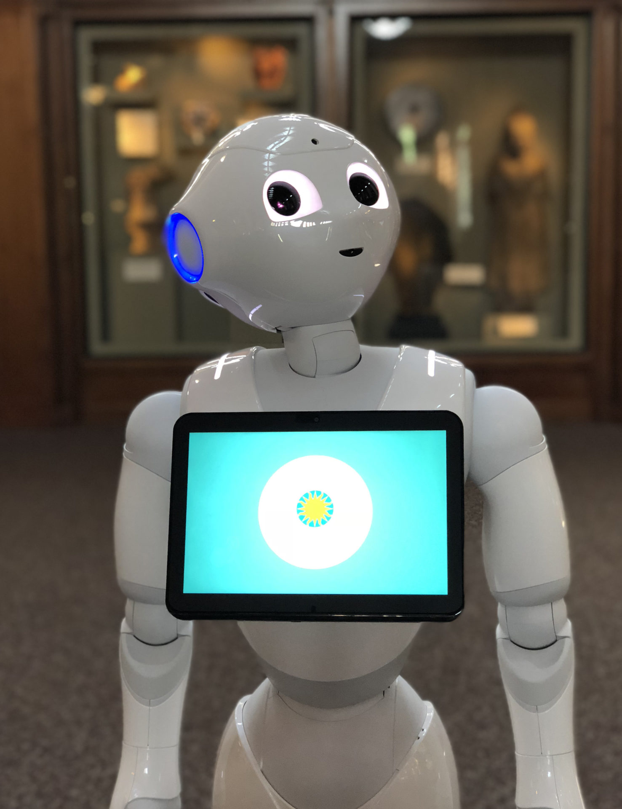
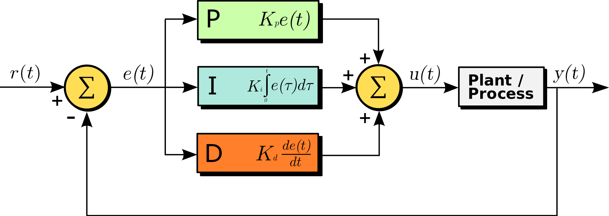

# Balance Robot

## Requirements

1. The robot shall demonstrate a form of autonomous behaviour based on inputs from a camera and/or other sensors
2. The robot shall balance on two wheels, with a centre of gravity above the axis of rotation of the wheels
3. There shall be remote control interface that allows a user to enable or control the autonomous behaviour, and to move the robot manually in two dimensions around a flat surface
    1. The user interface shall display useful information about the power status of the robot, such as power consumption and remaining battery energy
    2. The user interface shall provide inputs and display information that are pertinent to the demonstrator application.
4. The robot should augment the provided chassis with a head unit that suits the chosen demonstrator application

## Resources Provided

### Hardware Kit

Your starter kit contains:

| Qty. | Item |
| ---- | ---- |
| 2    | Robot Chassis Kits with Motors and Power PCB |
| 4    | Temporary Robot Stabilisers |
| 4    | 7.2V 2000mAh NiMH battery |
| 2    | Raspberry Pi 3 Model B with keyboard |
| 2    | ESP32 Microcontroller Module |
| 2    | Breadboard |
| 2    | Accelerometer/Gyroscope Module (MPU)|
| 3    | Wiring Ribbon |
| 2    | External PSU and battery bypass Cable |
| 4    | USB Cable |

### Software

Starter code is provided for the ESP32 MCU to demonstrate stepper motor control and the interface with the MPU

## Getting Started

Try the following steps to get started with the project:

1. Research and evaluate options for the demonstration task. Assess the capabilities of sensors and libraries that might be useful.
2. Assemble the chassis by following the [assembly instructions](doc/balance-assembly.md)
3. Download, compile and run the example code for the ESP32, which runs the motors. Use this code as a base for both balancing and non-balancing development streams.
4. Begin to construct the communication system for your robot. Aim for an initial milestone which allows you to command simple movements with the chain Web UI → server/database → Raspberry Pi → ESP32

## Technical Guide

This section contains advice on the following sections:

1. [Batteries](#batteries)
2. [Robot Function](#robot-function)
3. [Balancing](#balancing)
4. [Onboard Computing](#onboard-computing)
5. [Chassis (including motor drive and power electronics)](#chassis)

### Batteries

The chassis has mounting points for two nickel metal hydride battery packs, each 7.2V 2000mAh.
The batteries connect directly to the power PCB with the provided connectors.

> [!WARNING]  
> Battery safety is important and we have had fire incidents in the past. Therefore, you must follow battery safety rules:
>
> - Use only the provided batteries. Do not use batteries you already own or buy your own batteries
> - Bring batteries to the lab technicians when they are depleted for exchange with charged batteries. Do not recharge the batteries.
> - Use the provided power PCB. Do not build your own circuit for battery input or modify the PCB.
> - Use the included PSU as an alternative power source so you can continue work if your batteries are depleted.

### Robot Function

This project option is open-ended because the high-level function of the robot is not defined.
Think carefully about what your robot should do and look for functionality that can be developed incrementally so that your final demonstration can be a success even if some of your ideas don't work as planned.
The Raspberry Pi supports a camera and you will find libraries and tutorials online that allow you to implement some basic computer vision tasks.

You may wish your robot to avoid obstacles and it may be easiest to do this with dedicated sensors based on optical or ultrasonic proximity, or even mechanical touch.
Detecting obstacles with a camera is a complex task because significant signal processing is needed to convert a 2D camera stream into a 3D representation of the environment, but you may find libraries that help.

You can choose whether your robot should operate in a real world environment or a special arena that is designed to demonstrate a specific task.
An arena is available for your use, and you can configure it with markings and/or objects to suit your purpose.
A typical arena task might be to follow a line, navigate a maze or map the positions of objects.
You can use lighting to help, in the form of flexible LED strips, glowing beacons and overhead lamps.

A robot operating in real-world environments will need to cope with greater uncertainty, and it may encounter moving objects, uneven surfaces and challenging lighting conditions.
Typical tasks for robots in this environment could be meet-and-greet/personal assistance, search and rescue and domestic help.
Think about how you can constrain the problem so you can develop functionality incrementally.
A robot in a real-world environment may be reliant on third-party vision libraries, so make sure you understand the capabilities and limits of any candidate libraries before you commit yourself to achieving a particular goal.

Make use of consultation sessions with staff to refine and develop your ideas.

### Balancing

One of the project requirements is that the robot can balance on two wheels, but it's important to decouple this requirement from the other tasks that you face in your project planning.
In other words, ensure that you can work on balancing independently from developing robot functionality, otherwise some team members might find their progress blocked while others work on balancing.
To help with this, each group is provided with two robot chassis and a set of stabilisers that can be fitted to the robot to keep it upright without the need for a balancing algorithm.

#### Control 

Balancing can be achieved with a PID controller, where the input is the current angle of tilt of the robot, the setpoint is the desired angle of tilt (usually upright) and the output is the motor acceleration.
Motor acceleration is used because accelerating the wheels provides a force at the base of the robot that corrects any error in the tilt angle.
Modelling the balancing algorithm is encouraged, but often the best way to tune the algorithm is to adjust the PID parameters manually with trial-and-error.
In general, if the robot runs away and falls over, then more proportional gain is needed to provide a greater restoring force.
If the robot oscillates before falling over, then proportional gain should be decreased or differential gain increased to introduce damping and remove overshoot.

The setpoint tilt angle might not be exactly zero due to an offset of the centre of mass of the robot from the central axis use to measure tilt.
There can also be misalignment between the tilt sensor and the axis.
You can find out this offset by turning the motors off and finding the tilt angle measured when the robot naturally balances as you gently hold it upright.
Finding the right setpoint for a static condition can avoid needing to use an integral term in the controller because there is no steady-state error when the robot is perfectly balanced.

Once the robot can balance in a static position, the next task is to make it move around.
One way to do this is to use a cascaded controller, which means that the setpoint for the inner loop (desired tilt angle in this case) is itself set by a PID controller.
If the robot is tilted off balance and that tilt angle is constant, then the motors must accelerate continuously at a constant rate to provide a force that counteracts the toppling force.
Therefore, if you want to move the robot to another location, your control algorithm should change the tilt angle for a short time to accelerate the robot, then tilt it in the opposite direction to slow it down before it reaches its target position.
A PID controller can do this, but note that the acceleration required to hold the robot at a non-zero tilt angle will quickly speed the wheels to their maximum speed, at which point the robot will fall over.
A good first step is to make the outer control loop a speed controller.
That way, the robot will bring the tilt angle back to the balanced condition before the wheels reach their speed limit.

#### Measuring Tilt

Tilt measurement is achieved with a MPU6050 combined accelerometer and gyroscope sensor.
The sensor and a measurement library are provided and the base unit of the chassis has an internal mounting point for the sensor.
Mounting the sensor in this part of the chassis means there is a strong mechanical coupling to the wheels so measurement is more accurate.

The accelerometer measures in three axes, so it can be used to detect the direction of gravity and therefore the tilt angle of the robot with respect to gravity.
However, without additional information, it is impossible to distinguish between a gravitational force and a force due to acceleration.
That means if the robot accelerates in the longitudinal (back/forward) direction, either to move the robot or just to maintain balance, an error will be introduced in the tilt angle measurement.

This error can be reduced by using the gyroscope measurement.
Silicon gyroscopes of this type measure the differential of tilt angle, i.e. the rate of change of angle.
This differential can be used directly to calculate the D term of a PID controller, but an absolute measure of tilt is needed for the P term.
Integrating the output of the sensor will work, but only for a short time because any small error in the measurement (there is always error) will be accumulated until the result becomes completely useless.

These problems can be resolved by using a _Complementary Filter_.
Notice that the integral of the gyroscope is useful over short time periods, before the error grows too large.
Meanwhile, the tilt angle calculation from the accelerometer will have short-lived error transients due to longitudinal movements, but over a long period of time these will average to zero because the robot cannot accelerate indefinitely.
Therefore, a complementary filter works by applying a low-pass filter to the tilt measured by acceleration and summing it with a high-pass-filtered tilt measured by the gyroscope.

The form of the complementary filter is: $\Theta_{n} = (1-C) \Theta_a + C (\frac{d\Theta_g}{dt} \Delta t + \Theta_{n-1})$

Here, $\Theta_{n}$ is the calculated tilt at iteration $n$, while $\Theta_{n-1}$ is the calculation from the previous iteration.
$\Theta_a$ is the tilt angle measured by accelerometer and $\frac{d\Theta_g}{dt}$ is the differential tilt angle measured with the gyroscope.
$\Delta t$ is the time interval between iterations and $C$ is a factor between 0 and 1 that sets the time constant - typically it is close to 1.

With $C$ close to 1, you can see that $\Theta_{n}$ at any given iteration is mostly derived by integrating the gyroscope measurement (multiplying by $\Delta T$) and adding it to the previous tilt angle.
This means any rapid changes in tilt, which are measured accurately by the gyroscope without interference from longitudinal acceleration, are reflected in $\Theta_{n}$.
Because $C<1$, any constant error in $\frac{d\Theta_g}{dt}$ will not accumulate forever and eventually it will converge to a constant error in $\Theta_{n}$, which is manageable.
Meanwhile, the small contribution from $\Theta_a$ will gradually accumulate so, in static conditions after a long period of time, $\Theta_{n} = \Theta_{a} + e_g$, where $e_g$ is the converged accumulated error from the gyroscope.
With an appropriate value of $C$, $e_g$ will be small and constant, so it will not affect the stability of the PID controller.

### Onboard Computing

The starter kit contains two embedded computing devices: a Raspberry Pi 3 and an ESP32.

#### Raspberry Pi

Raspberry Pi is complete single-board computer that runs Linux.
It has HDMI graphics, USB host ports and on board Wi-Fi and Bluetooth.
You can connect it up with the provided HDMI cable and keyboard and interact with it using the command line or desktop environment.

You can write code for the Raspberry Pi using many languages and environments, but the most relevant are likely to be C++ or Python.

#### ESP32

ESP32 is a WiFi-enabled microntroller.
A microcontroller does not run an operating system in the traditional sense and instead the code you write is executed _bare-metal_, without device drivers, memory management, file system or other abstractions that an operating system places between your code and the hardware.
The lack of operating system means that development for a microcontroller can be slow, but it does have a major advantage when it comes to realtime performance.
Since there is no operating system to deprioritise your task in favour of other processes and system management tasks, you can run code with confidence that things will happen when you expect.
In the context of this project, that is useful for tasks such as motor and balance control, which rely on data being sensed and pulses sent to the motor at exactly the right time.

The ESP32 has a USB device port, which allows you to download code and observe the output on a serial terminal.
Take care when printing messages on the serial terminal, because complex or frequent messages can prevent your code from executing at the expected speed.
In particular, do not add serial print statements to high-frequency interrupt functions.
The USB port can be connected to the Raspberry Pi, allowing you to exchange messages between the two computers.

Starter code for the ESP32 [is provided](esp32-starter/).
It runs the stepper motors at a speed proportional to the angle of tilt measured by the accelerometer.
This isn't the correct algorithm to achieve balancing, but it does show integration of the MPU6050 and stepper motors.
An Adafruit library is used to communicate with the MPU6050 and the stepper library is written in-house and included as a header file.
It's designed for high-speed interrupt operation on the ESP32 with a frequently-changing motor acceleration parameter, which isn't supported by main Arduino library for stepper motors.

The starter code is configured as a [PlatformIO](https://platformio.org/) project, which is a Visual Studio Code plugin for embedded programming. The code uses the Arduino framework, giving access to Arduino libraries and the structure based on `setup()` and `loop()`.

The ESP32 comes with a [breakout board](doc/ESP32-ADC.pdf) that provides easy connection to the IO pins. The ESP32 GPIO numbers are indicated on the PCB, and you can inspect the starter code to find the pin numbers you need to get the example working. Note that SCL and SDA for the MPU6050 uses pins 22 and 21, not the pins labelled SCL and SDA. The breakout board also includes a MCP3208 ADC with 4.096V reference for measuring analogue voltages - it is more accurate than the ADC in the ESP32. The starter code shows how the voltage on pin A0 can be read and sent on the serial terminal.

### Chassis

[Instructions for assembling the chassis](doc/balance-assembly)

The provided robot chassis allows you to build a robot and get it moving around, including balancing.
The chassis is incomplete at the top, so you may wish to make a head unit that suits the function of your robot.
For example you could mount a Raspberry Pi camera or LEDs for user feedback.
There is no need to redesign the lower part of the chassis.

#### Power PCB

The chassis includes a PCB for power functions in the robot.
We provide this PCB so that you can get your robot moving quickly, and to avoid safety risks from handling the large currents that can be sourced by the batteries.
The PCB contains:

- Battery terminals and a main fuse to prevent excessive current
- Power switches, one main switch to connect/isolate the batteries and one motor switch to power the motors. The second switch allows you to maintain power to your logic and sensors when the motors are isolated.
- A 5V, 3A power converter so you can run a Raspberry Pi and other logic from the batteries via 2 USB power outputs
- Two stepper motor drivers, which drive the motors in one angular increment for every input pulse. A 3-way configuration switch sets the angular resolution (microstepping).
- Two current sense resistors, which provide a voltage difference that you can measure to find the current used by the motors and logic

The PCB has two connectors for you to interface with.

J3 is for motor control and it has the following pinout:

| Pin | Name | Type | Function |
| --- | ---- | ---- | -------- |
| 1   | S2   | IN   | Motor 2 Step |
| 2   | D2   | IN   | Motor 2 Direction |
| 3   | S1   | IN   | Motor 1 Step |
| 4   | D1   | IN   | Motor 1 Direction |
| 5   | S3   | N/A  | Motor 3 not implemented |
| 6   | D3   | N/A  | Motor 3 not implemented |
| 7   | EN   | IN   | Enable all motors |
| 8   | GND  | GND  | GND reference for inputs |

All inputs have a range for logic high of 3.3-5V

J2 is for power monitoring and it has the following pinout:

| Pin | Name | Type | Function |
| --- | ---- | ---- | -------- |
| 1   | VB   | PWR  | Battery Voltage ⚠ |
| 2   | GND  | GND  | Ground |
| 3   | I5   | PWR  | Current sense for 5V supply ⚠ |
| 4   | 5V   | PWR  | 5V supply ⚠ |
| 5   | IM   | PWR  | Current sense for motor supply ⚠ |
| 6   | VM   | PWR  | Motor supply voltage ⚠ |

> [!WARNING]  
> Pins marked ⚠ will destroy your logic (Raspberry Pi, ESP32) instantly if you connect them directly to an I/O pin.
> They are also not current limited and they could cause damage from excessive current flow.
> Do not use these pins to power your logic - use the USB connections instead as they are more reliable.

Using J2 connections to monitor voltage and current requires care to avoid causing damage.
The current sense pins are connected to small value resistors in series with their associated supply so you can measure the voltage difference across the resistors.

Use the following rules to use J2 connections safely and effectively:

- You will always need some kind of analogue interface circuit to reduce the voltage from the monitoring pins and connect them to an ADC input
- Test your interface circuit carefully with a bench PSU and a multimeter before connecting it to your batteries and logic
- Ensure that your circuit is constructed and connected robustly. In particular, ensure that the ground connection cannot come lose because that would cause your output voltage to rise to the level of the input voltage
- Use a 10kΩ resistor in series with your ADC connections to prevent large current flow
- Take care when using a circuit powered from one voltage rail to monitor current flowing in another voltage rail. Some circuits can become powered from their inputs if their normal power supply is not turned on

The current measurement resistors are _high side_, meaning that they are in series with the positive rail of the relevant supply.
The resistances are 0.01Ω (5V) and 0.1Ω (motors), which means, for example, a current of 1A in the 5V supply would give you outputs of 5V and 4.99V on the I5 and 5V pins respectively.
You could reduce both of these voltages with potential dividers and measure both with an ADC input to find the difference, but the accuracy and noise might be poor.
A better method would be to build a _differential amplifier_ from an opamp, which will amplify the difference between two inputs and present it as a single voltage relative to a reference.
For example, the case above with a differential gain of 10 and a 1.25V reference would give an output of 1.75V, which is convenient voltage for measuring with an ADC with a 4.096V reference.

When designing an amplifier for this purpose, make sure the opamp has a power supply range that supports the input voltage, and that it supports _rail-to-rail input_, meaning that it works even when the input voltage equals the supply voltage.

[Circuit diagram of the power PCB](doc/balance-power.pdf)

#### Stepper Motors

The chassis uses stepper motors, which are brushless motors that require a sequence of input currents to cycle the magnetic field and make them turn.
Each step in the sequence advances the motor by a precise angle, determined by the spacing of teeth on the internal rotor.
Stepper motors are not very efficient but they provide a high torque without gearing and the associated inertia, so they can drive wheels directly and change direction quickly.
The fixed angular increments also allow you to count the number of revolutions of the motor without needing a separate sensor.
That means you can easily find the distance travelled by the robot.

The power PCB contains driver modules for the motors, which take logic inputs (step, direction and enable) and generate the required currents in the motor windings.

Stepper motors use a lot of current and you will notice that both the motors and the driver modules become warm when they are running.
The motor driver modules on the PCB have adjustment points to control the motor current, but do not attempt to adjust these because they are fragile and difficult to set.
The motor drive currents have all been set to a value that will balance the robot without overheating.
Please ask for help if you suspect a problem with the motor drivers or drive current.
A good first step is always to revert to the base code.

