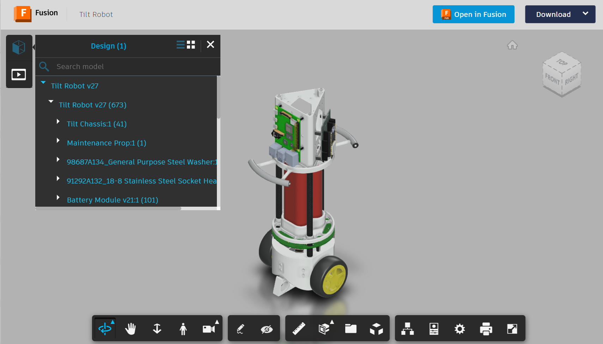

# Balance Robot

## Chassis Assembly Instructions

Refer to the [interactive model](https://a360.co/4mav1zy) to help you assemble the base chassis.
Try using the 'Explode Model' and 'Model Browser' features on the toolbar to see get different views of the assembly.
The model browser allows you to highlight the various components referred to in the instructions below

  1. Fit a washer and a M4 nut to the end of each threaded tie rod. The end of the rod should be flush (coplanar) with one of the faces of the nut. Do not thread the nut further onto the rod than necessary.
  2. From inside the body of the logic module, insert each rod into one of the three holes at the bottom of the logic module. Insert the rod fully so that the washer and nut rest on the hole support features inside the body and the rods protrude from the bottom of the carrier. The rods should not pass through the holes on the top of the logic module.
  3. Pass each tie rod through the one of the three matching holes in the flat top face of the battery holder top and slide the battery holder top along to meet the logic module.
  4. Pass a long carbon fibre tube (battery strut) over each tie rod and fit it into the socket on the battery holder top. The tubes are a tight push fit in the sockets so make sure they are fully inserted.
  5. Pass each tie rod into one of the three matching holes in the featured face of the battery holder. The cutouts that receive the batteries should align with the corresponding features on the battery holder top. You won't be able to manipulate the tie rod precisely inside the carbon fibre tube, so use a small tool through the holes in the battery holder top to shift each rod end into alignment with its hole. Once the rods are aligned with the holes, push the carbon fibre tubes fully into the sockets on the battery base.
  6. Fit a M4x8mm threaded spacer to the end of each rod and tighten it. Place a finger over the corresponding nut in the logic module to ensure the tie rod becomes tensioned. Ensure that the spacer is located centrally in the recess on the bottom of the battery base.
  7. Test that both batteries can be inserted and removed. Both battery locations are accessed through the same side of the battery carrier. Begin by passing the battery connector through the hole in the battery base, then push the leaded end of the battery into the springs until the other end of the battery can be swung upright into the recess on the battery holder top.
  8. Fit a M3x7mm stand-off into each of the three threaded holes on the bottom of the battery base.
  9. Place the PCB assembly on the end of the stand-offs with the component side facing away from the battery base. Orientate the PCB so that each stand-off is aligned with a small round hole and the square cutouts are aligned with the corresponding holes in the battery base. Secure the PCB assembly with 3 M3x6mm screws.
  10. Fit a short carbon fibre spacer through each large round hole on the PCB and over the threaded spacer behind it. Insert each spacer fully into its socket on battery base.
  11. (Optional) Fit the MPU6050 module inside the motor chassis using the two threaded holes and 2 M3x6mm screws. The component side of the module should face the inside wall of the motor chassis. The MPU6050 can be mounted on other locations on the robot that are easier to access, but the motor chassis offers good mechanical coupling to the wheels and makes it easier to achieve stability. You may wish to connect a ribbon cable at this time - make a record of the wire colours against the MPU6050 terminals.
  12. Place the motor chassis on the spacers protruding from the battery base. Insert the tubes fully into the sockets on the motor chassis. Check that the top face of the motor chassis is parallel with the bottom face of the battery base. You may wish to align planes of symmetry of the motor chassis and battery carrier for aesthetic reasons.
  13. Fit stepper motors inside the motor chassis with the shafts protruding through the large circular holes on the sides. Ensure that the raised step around the shaft fits into the hole in the chassis. Pass the motor cables through the top of the motor chassis and around the edge of the PCB. Orientate the motors to ensure a neat cable routing. Fix the motors with M3x6mm screws.
  14. Push a wheel onto each motor shaft. The bore inside the wheel has two sections where the radius is slightly reduced - ensure these don't align with the flat on the motor shaft. Make sure the inner face of the wheel doesn't contact the motor fixing screws.
  15. (Optional) Attach roller casters to each stabiliser leg with M3x6mm screws and M3 nuts. Fit the stabiliser legs to the mounting points on the front and back of the chassis with M3x6mm screws. Adjust the height of the legs before tightening to ensure both wheels and both roller casters are in contact with the ground surface. The stabiliser legs allow the robot to be operated without a balancing algorithm.
  16. Fit 3 M3x10mm threaded spacers to the underside of ESP32 breakout module with M3x6mm screws through the mounting holes. It is not possible to fit a screw to one of the mounting holes due to proximity of a connector. Find a position on the logic module where the spacers align with fixing holes and use M3x6mm screws from the inside of the logic module to fix the spacers to the carrier. Fix a fourth spacer to the carrier underneath the unused mounting hole of the breakout module and leave it resting against the breakout module without a fastener.
  17. Fit 4 M2.5x7mm threaded spacers to the underside of the Raspberry Pi with M2.5x6mm screws. Find a position on the logic module where the spacers align with fixing holes and use M2.5x6mm screws from the inside of the logic module to fix the spacers to the carrier.
