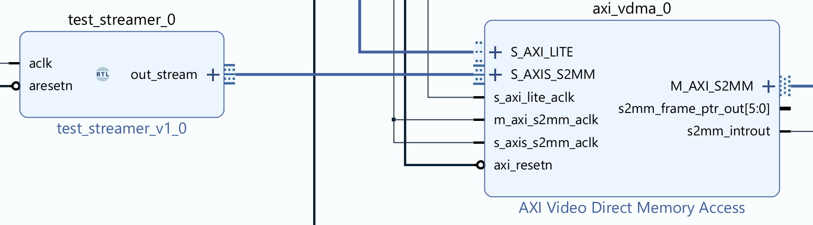
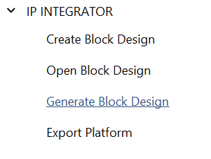

# Mathematics Accelerator

## Requirements

1. The system shall display a visualisation of a mathematical function that is computed in real time
    1. The function shall be computationally intensive, such that it is not trivial to generate the visualisation at the required resolution and frame rate
    2. The computation should be 'embarrassingly parallel', which means that multiple solutions of the problem, pixels in this case, can be computed independently with no data dependence between them
2. The visualisation shall be generated with the supplied PYNQ-1000 SoC FPGA platform with an accelerator for the soft logic of the FPGA that computes the inner loops of the calculation
   1. The accelerator shall be described using Verilog or SystemVerilog
   2. The accelerator shall provide an interface with the integrated CPU for the adjustment of parameters
   3. The number formats and word lengths used in the accelerator should be selected to optimise the trade-off between visualisation accuracy and computational throughput
   4. The computational throughput of the accelerated implementation shall exceed that of a CPU-only alternative programmed with C, C++ or Cython
3. The system shall provide a user interface to enhance the function of the visualisation as an educational tool.
    1. The user interface may be implemented using separate hardware to the visualisation computer
    2. The user interface shall allow a user to adjust parameters of the visualisation in an intuitive or interesting way
    3. The user interface should provide information about the visualisation as an overlay on the image or via a separate medium

## Resources Provided

### Hardware

Pynq kits can be borrowed from EEE Stores. They contain:

- A Pynq FPGA board
- HDMI cable and HDMI-USB adapter
- Ethernet cable and Ethernet-USB adapter
- USB Cable
- WiFi adapter

### Software

Tutorials and code examples for the Pynq can be found on the official GitHub repository.

An example project shows generation of a video pattern using the Zynq CPU core and FPGA logic.

### Project budget

The project requirements specify that the Pynq board is used to generate the visualisation. However, you may wish to purchase additional components to implement the user interface and a budget is available for this.

## Getting started

These are suggested tasks for making a start on the project:

You should begin by following the [Pynq setup guide](https://pynq.readthedocs.io/en/latest/getting_started/pynq_z1_setup.html)

The example notebook for video uses a HDMI input, which might not be readily available to you, and it can be unstable. Instead, load the notebooks provided on the project repository

1. Research areas of mathematics that would make good visualisation and could be implemented with an algorithm that iterates over the image in a raster pattern.
2. Set up a hardware simulation flow with Verilator that can run a Verilog module that generates the colour for given pixel coordinates. Begin with a simple test pattern. Write a simulation wrapper that loops over the pixels in an image and visualises the result as an image file
3. Consider interesting methods for human interaction. Look for hardware suggestions or software libraries that might help
4. Download the [Pynq SD Card Image](https://www.pynq.io/boards.html) onto the Pynq SD Card. You can use [Raspberry Pi Imager](https://www.raspberrypi.com/software/) to write the image. Familiarise yourself with the Pynq operating system and Python overlay interface using the demo notebook. Create a placeholder visualisation in software and set up an interface with a remote server or database that will pass in user parameters
5. Set up the Vivado tool flow that will allow you to generate your own Pynq overlay

## Technical information and suggestions

### Powering the Zynq

The Pynq board can be powered by the USB interface (PROG UART) or an external power supply. Move the jumper JP5 to USB to use USB power and REG to use the power supply.

### Connectivity

You will need network connectivity to interface with your board.

1. Ethernet (direct): you can plug the Zynq board into an ethernet port on your home router with the included cable. You will need to find the board's IP address to connect - you can do this by looking at DHCP leases on the configuration page for your router, or by typing `ip addr` into the USB command prompt. The board  won't work by connecting it to an ethernet port on the College network unless it happens to have been registered with ICT.
2. Ethernet (via host): the kit includes a USB ethernet adapter, which you can use to connect your Pynq board to the internet via your computer. Connect the Pynq to the ethernet socket and plug the adapter into a USB port on your computer. Then, you need to share your internet connection with the ethernet adapter you have plugged in:
   1. Windows: follow [these instructions](https://www.tomshardware.com/how-to/share-internet-connection-windows-ethernet-wi-fi).
   2. MacOS: follow [these instructions](https://support.apple.com/en-gb/guide/mac-help/mchlp1540/mac)
3. WiFi: the kit also includes a USB WiFi dongle. Plug it into the USB Host port on the Pynq and the operating system will automatically set it up as a networking device. You will need to access a terminal via Ethernet or USB cable to set up WiFi.

### Development tools

The Pynq has a Jupyter notebook server installed, which allows you to edit and run Python code interactively via a web browser

The configuration for the FPGA logic in a Pynq system is called an overlay, and to edit it you will need [Vivado](https://www.xilinx.com/support/download.html) (version 2023.2). Vivado can be run on Windows or Linux, so to run it on MacOS you'll need to install it in a Virtual Machine. The overlay is loaded onto the FPGA with a driver and Python API on the Pynq processor system, so you won't need USB drivers to download the overlay from your computer.

Minimise the installation size for Vivado by enabling support only for the Zynq-7000 SoC, which is the device family used on the Pynq-Z1 board.

### Candidate Visualisations

The purpose of the project is to showcase hardware implementation of an algorithm. A visualisation of a mathematical algorithm is a good area to work with because:

1. A real-time, high-resolution visualisation requires the generation of millions pixels per second, so it's a good demonstration of the computational throughput of an FPGA
2. A mathematical function of the form $a=f(x,y)$, where $a$ is a pixel colour and $x, y$ are the pixel coordinates, is well suited for hardware video generation, which outputs pixels one by one in a raster pattern. A function of this type is also _embarrasingly parallel_, which means that multiple outputs can be computed simultaneously with no need to share any information between them
3. Many numerical algorithms have an interesting dependency on numerical precision. FPGAs can use custom word lengths and achieve significant optimisations compared to software implementations.

Visualising fractals is a common exercise in this domain, since they are visually interesting and a good test of computational throughput. An implementation for Pynq [already exists](https://github.com/FredKellerman/pynq-juliabrot), but HDL is not provided.

Simulations are a popular option for visualisation demos, but they tend to be harder to parallelise because the simulation has a global state that must be shared between execution units. For example, in [N-body simulation](https://en.wikipedia.org/wiki/N-body_simulation), the behaviour of every particle in the system depends on the state of every other particle. Then, the particles must be rendered, which requires random access to a video frame buffer (since each particle could be anywhere on the screen), instead of much simpler sequential access. Therefore, these kinds of problems are not recommended unless you are feeling very confident about your digital design skills.

### Working with Pynq Overlays

In Pynq, an overlay is a bitstream (programmable logic configuration) plus a Python library that interfaces with it. You will need to develop programmable logic but a Python library is optional because you can use the pre-existing base classes. A custom library for your overlay would make your code neater and more reusable.

This repository contains two Jupyter notebooks to demonstrate the software side of Pynq overlays. Copy the notebooks to `/home/xilinx/jupyter_notebooks/` on the Pynq and load them in a browser at `http://<Pynq IP address>:9090`

- [Software Image Generation](../maths-accelerator/software-image-generation.ipynb) works with the Pynq base overlay. It shows how you can create an image array and send it to the HDMI output
- [Hardware Image Generation](../maths-accelerator/hardware-image-generation.ipynb) works with the project example overlay. It shows how to grab a frame from a hardware image generator and display it on the HDMI output
#### Block Design

The example design is based on the PYNQ base configuration with the addition of a block that generates a video test pattern.
That block is written in Verilog and connected to the rest of the system with the IP Integrator tool.
The block has two main interfaces:

1. An AXI Stream Output (Master - AMD still uses outdated master/slave terminology), which outputs the video data in raster order. A stream interface is just a bus (32-bits in this case) of data, with a valid signal to indicate each clock cycle when it has been updated. A ready signal acts as _backpressure_, which allows the receiver to pause transmission if it is not ready. A done signal indicates the end of a packet of data, which is a complete horizontal line in the case of video data.
2. An AXI-Lite Slave port, which allows the control registers of the block to appear as a memory-mapped peripheral. If the user (via Python code on the processor system) wants to change a parameter of the visualisation, they would write the parameter to a specific address on the memory bus. The bus logic of the CPU and IP integrator system ensures that writes to this address are directed to this logic block. When the design is compiled, the address map for the entire system is written to a file, which is then used to find the address for a peripheral when it is accessed by the user code. The AXI-Lite interface has slower data throughput than the streaming interface.



The stream output from the block is connected to a Video DMA (direct memory access) IP Block inside the Video sub-block. This block can write to the main memory system independently from the CPU. When a video frame is generated, the DMA writes the image to an array in memory, where it can be accessed by the CPU or read by another DMA block for output to the video device. DMA blocks are configured by the CPU core by a separate AXI-Lite interface but after that they move data around the system without further involvement, which is much quicker than using the CPU core to access every pixel.

Since the example design is already working, you can implement your design by adding your logic to the frame generator block. Make sure that it can still stream pixels out as required. The rest of the system will handle the rest. Modifying the design in the IP Intergator is not necessary, except in advanced cases.

#### The Example Image Generator

The HDL for the example image generator is in `overlay/ip/pixel_generator.v`.
The file uses a very simple combination of the x and y coordinates to generate each pixel:

```verilog
wire [7:0] r, g, b;
assign r = x[7:0];
assign g = y[7:0];
assign b = x[6:0]+y[6:0];
```

A counter iterates the x and y coordinates over the image so that each pixel is generated in turn:

```verilog
localparam X_SIZE = 640;
localparam Y_SIZE = 480;

reg [9:0] x;
reg [8:0] y;

wire first = (x == 0) & (y==0);
wire lastx = (x == X_SIZE - 1);
wire lasty = (y == Y_SIZE - 1);

always @(posedge aclk) begin
    if (aresetn) begin
        if (ready & valid_int) begin
            if (lastx) begin
                x <= 9'd0;
                if (lasty) begin
                    y <= 9'd0;
                end
                else begin
                    y <= y + 9'd1;
                end
            end
            else x <= x + 9'd1;
        end
    end
    else begin
        x <= 0;
        y <= 0;
    end
end
```

Note that the counter only advances when `ready` and `valid_int` are true. `ready` is the backpressure signal from the downstream logic - it ensures that new pixels are generated only when the VDMA is ready to write them into memory. `valid_int` is the valid (internal) signal from the generator, which is passed to downstream logic to indicate when a new pixel is ready. Since this example just uses some wiring to convert pixel coordinates into colours, the output is always valid:

```verilog
wire valid_int = 1'b1;
```

A more complex algorithm might take multiple clock cycles to generate each pixel, in which case `valid` should only be true once the calculation is complete.

The signals `first` and `lastx` are true during the first pixel of each frame and the last pixel of each line respectively. These signals are passed to downstream logic along with the pixel data and they are used to synchronise the data to the correct position on the display.

The module also instantiates a sub-module `pixel_packer`, which sits between the generated `r`,`g`,`b` values and the stream output. The VDMA module expects to receive 32-bit words of data since these map neatly onto the main memory bus. The three concatenated colour values total only 24 bits, so the pixel packer packs 4 24-bit pixels into 3 32-bit words. Generating the 4 pixels still takes 4 clock cycles (assuming `ready` is true), so the output `valid` signal from the pixel packer is manipulated so that it is only high for 3 out of 4 clock cycles.

To summarise the `ready` and `valid` signals:
- `ready` is asserted by the stream receiver when it is able to accept a new word
- `valid` is asserted by the stream transmitter when it has generated a new word (it's always true in the example)
- Together, these signals implement handshaking, and both must be true at the same time for data transfer to take place and the transmitter to advance to the next word

### Building the Starter Project

1. Install [Vivado 2023.2](https://www.xilinx.com/support/download.html)
2. Clone this repository onto your computer
3. Run the build script that generates the project
   1. Start Vivado 2023.2
   2. Go to Window→TCL Console
   3. In the console, type `cd <repository path>/maths-accelerator/overlay`. You will need to use a Unix-style path with `/` instead of `\`
   4. Enter the command `source build_ip.tcl`
   4. Enter the command `source base.tcl`
4. The scripts compile some IP blocks and generate a Vivado project in \<repository path\>/maths-accelerator/overlay/base. Open it in Vivado
5. Generate the block design with IP Integrator. This converts the block design to Verilog netlists and creates the hardware handoff file `.hwh` with information about the bus structure and address map for the operating system.



6. Implement the FPGA bitstream. Vivado will ask to synthesise and implement the design as well. This process creates a bitstream `.bit` file that configures the programmable logic on the FPGA


7. Find the output files and copy them to the user home directory /user/xilinx on the Pynq. Rename them so the files have the same name (keep the `.hwh` and `.bit` extensions). I recommend adding a revision number that you increment each time so you can be sure you are running the latest implementation. You can copy files to the Pynq with `scp` or drag and drop when you have a terminal open in MobaXterm

   1. The `.hwh` file is in `base.gen/sources_1/bd/base/hw_handoff`
   2. The `.bit` file is in `base.runs/impl_1`

> [!NOTE]  
> The build script copies the HDL source files from the src directory in the repository into the generated project structure. That means any changes to the files won't propagate to the FPGA design. Instead, you should edit the source files in the project structure - you can open them from the sources list in Vivado.

### Rebuilding the Pixel Generator IP

The image generator example is packaged as an IP block, which allows the Pynq Python to discover its memory-mapped input/output (MMIO) interface and enable simple communication between software and hardware. When you edit the Verilog for the pixel generator, you need to repackage this IP block and then update your design. Changing the source file alone won't propagate your changes to the overlay compilation. Follow these steps to repackage the IP:

1. The Pixel Generator IP is packaged in its own Vivado project and you'll need to create this project the first time you want to make an edit. Right-click on the Pixel Generator in the block diagram and choose "Edit in IP Packager". A box appears asking for a name and location for the new project. This can be anywhere except inside the IP library, so `<repository path>/maths-accelerator/overlay/pixel_generator_project/` will do. Open the new project in Vivado.
2. The project will be populated with the two source files pixel_generator.v and packer.v, located in `<repository path>/maths-accelerator/overlay/ip/pixel_generator_1.0`. You can edit the files and add your own to the project. Place any new files in the same directory as the existing source files.
3. Click "Edit Packaged IP" in the Flow Navigator. This opens the Package IP window. Go to "Review and Package" and click "Re-Package IP"
4. Now the IP needs to be updated in the main project. Switch to that window and open the project settings. Go to "IP Repository" and click "Refresh All". You can also do this by entering the TCL command `update_ip_catalog -rebuild`
5. You will now see a warning at the top of the Block Design window that says an IP upgrade is available. Click "Show IP Status", then in the IP Status Log click "Upgrade All". You can also run the TCL command `upgrade_ip -vlnv xilinx.com:user:pixel_generator:1.0 [get_ips  base_pixel_generator_0_0]`
6. The upgrade launches an IP rebuild process. After that you can generate the bitstream and run it on the Pynq.

### Simulating the Image Generator

If you have tried building the Pynq overlay you will have found it takes quite a long time. Developing and debugging the HDL by loading onto hardware will be a slow process, and if you break the handshaking or send a malformed frame you may not be able to see any output at all.

Therefore, you should simulate your HDL to check it works. Don't be afraid to invest significant time into simulation infrastructure - it's an essential part of hardware design and you can present it as part as your delivered solution as well as benefit from the productivity rewards. As well as previewing a generated image, you can use simulation to find the number of clock cycles required and verify that the correct number of words are delivered.

#### Simulating with Icarus Verilog

[Icarus Verilog](https://github.com/steveicarus/iverilog) is an open source Verilog compiler and simulator. There are packages for Linux distributions and [binaries for Windows](https://bleyer.org/icarus/), along with other installation methods. The example Vivado project contains a basic testbench to simulate the image generator:

```verilog
`timescale 1ns / 1ps
module streamer_tb;

reg clk = 0;
reg rst = 0;
always #5 clk = !clk;

wire [31:0] data;
wire [3:0] keep;
wire last, valid, user;

test_streamer s1 (clk, rst, data, keep, last, 1'b1, valid, user);

  initial begin
  #20 rst = 1;
   $dumpfile("test.vcd");
   $dumpvars(0,streamer_tb);
     # 3500000 $finish;
  end

endmodule
```

You can run the simulation and view the results with the following commands:

```
iverilog -o stream streamer_tb.v packer.v test_streamer.v
vvp stream
gtkwave test.vcd                                                    
```

If you fork the final command or run it in another terminal, you can rerun the simulation and refresh the display without restarting the viewer.

The simulation runs for long enough (3,500,000 ns = 350,000 clock cycles) to generate one image frame at 640x480 resolution and 1 pixel per clock cycle.
