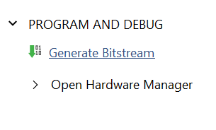
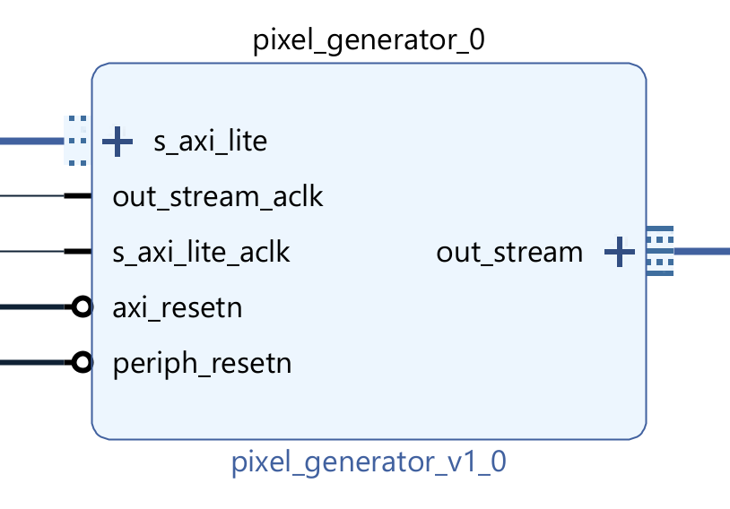

# Mathematics Accelerator

## Requirements

1. The system shall display a visualisation of a mathematical function that is computed in real time
    1. The function shall be computationally intensive, such that it is not trivial to generate the visualisation at the required resolution and frame rate
    2. The computation should be 'embarrassingly parallel', which means that multiple solutions of the problem, pixels in this case, can be computed independently with no data dependence between them
2. The visualisation shall be generated with the supplied PYNQ-Z1 SoC FPGA development board with an accelerator for the soft logic of the FPGA that computes the inner loops of the calculation
   1. The accelerator shall be described using Verilog or SystemVerilog
   2. The accelerator shall provide an interface with the integrated CPU for the adjustment of parameters
   3. The number formats and word lengths used in the accelerator should be selected to optimise the trade-off between visualisation accuracy and computational throughput
   4. The computational throughput of the accelerated implementation shall exceed that of a CPU-only alternative programmed with C, C++ or Cython
3. The system shall provide a user interface to enhance the function of the visualisation as an educational tool.
    1. The user interface may be implemented using separate hardware to the visualisation computer
    2. The user interface shall allow a user to adjust parameters of the visualisation in an intuitive or interesting way
    3. The user interface should provide information about the visualisation as an overlay on the image or via a separate medium

## Resources Provided

### Hardware

Pynq kits can be borrowed from EEE Stores. They contain:

- A Pynq FPGA board
- 16GB MicroSD Card
- HDMI cable
- Ethernet cable and Ethernet-USB adapter
- USB Cable

### Software

Tutorials and code examples for the Pynq can be found on the official GitHub repository.

An example project shows generation of a video pattern using the Zynq CPU core and FPGA logic.

### Project budget

The project requirements specify that the Pynq board is used to generate the visualisation. However, you may wish to purchase additional components to implement the user interface and a budget is available for this.

## Getting started

These are suggested tasks for making a start on the project:

1. Research areas of mathematics that would make good visualisation and could be implemented with an algorithm that iterates over the image in a raster pattern.
2. Set up a simulation flow with Icarus Verilog or Verilator that can run a Verilog module that generates pixels
3. Consider interesting methods for human interaction. Look for hardware suggestions or software libraries that might help
4. Download the [Pynq SD Card Image](https://www.pynq.io/boards.html) onto the Pynq SD Card. You can use [Raspberry Pi Imager](https://www.raspberrypi.com/software/) to write the image. Use the [Pynq setup guide](https://pynq.readthedocs.io/en/latest/getting_started/pynq_z1_setup.html), the [instructions below](#technical-information-and-suggestions) and the Jupyter Notebooks in this repository to familiarise yourself with the Pynq operating system. You can also refer to the notebooks included on the Pynq image, but I recommend avoiding the examples that use HDMI input.
5. Set up the [Vivado tool flow](#building-the-starter-project) that will allow you to generate your own Pynq overlay

## Technical information and suggestions

### Candidate Visualisations

The purpose of the project is to showcase hardware implementation of an algorithm. A visualisation of a mathematical algorithm is a good area to work with because:

1. A real-time, high-resolution visualisation requires the generation of millions pixels per second, so it's a good demonstration of the computational throughput of an FPGA
2. A mathematical function of the form $a=f(x,y)$, where $a$ is a pixel colour and $x, y$ are the pixel coordinates, is well suited for hardware video generation, which outputs pixels one by one in a raster pattern. A function of this type is also _embarrasingly parallel_, which means that multiple outputs can be computed simultaneously and independently
3. Many numerical algorithms have an interesting dependency on numerical precision. FPGAs can use custom word lengths and achieve significant optimisations compared to software implementations.

Visualising fractals is a common exercise in this domain, since they are visually interesting and a good test of computational throughput. An implementation for Pynq [already exists](https://github.com/FredKellerman/pynq-juliabrot), but HDL is not provided.

Simulations are a popular option for visualisation demos, but they tend to be harder to parallelise because the simulation has a global state that must be shared between execution units. For example, in [N-body simulation](https://en.wikipedia.org/wiki/N-body_simulation), the behaviour of every particle in the system depends on the state of every other particle. Furthermore, the particles must be rendered, which requires random access to a video frame buffer (since each particle could be anywhere on the screen), instead of simpler sequential (raster) access. Therefore, these kinds of problems are not recommended unless you are feeling confident about your digital design skills.

You may find it helpful to book a consultation meeting to discuss your choice of algorithm.

### Powering the Pynq

The Pynq board can be powered by the USB interface (PROG UART) or an external power supply. Move the jumper JP5 to USB to use USB power and REG to use the power supply.

### Connectivity

You will need network connectivity to interface with your board. The following options are available:

1. Ethernet (direct): you can plug the Pynq board into an ethernet port on your home router with the included cable. You will need to find the board's IP address to connect - you can do this by looking at DHCP leases on the configuration page for your router, or by typing `ip addr` into the USB-serial command prompt. The board  won't work by connecting it to an ethernet port on the College network unless it happens to have been previously registered with ICT.
2. Ethernet (via host): the kit includes a USB ethernet adapter, which you can use to connect your Pynq board to the internet via your computer. Connect the Pynq to the ethernet socket and plug the adapter into a USB port on your computer. Then, you need to share your internet connection with the ethernet adapter you have plugged in:
   1. Windows: follow [these instructions](https://www.tomshardware.com/how-to/share-internet-connection-windows-ethernet-wi-fi).
   2. MacOS: follow [these instructions](https://support.apple.com/en-gb/guide/mac-help/mchlp1540/mac)

### Developing on Pynq

Pynq is based on a Zynq-7000 system-on-chip FPGA, which contains a CPU core that runs Linux.
The Pynq ecosystem allows you to build custom logic into an _overlay_ and then interact with the logic and provide software support using a Python API.

### Software Development

The Pynq has a Jupyter notebook server installed, which allows you to edit and run Python code interactively via a web browser. This repository contains two Jupyter notebooks to demonstrate. Copy the notebooks to `/home/xilinx/jupyter_notebooks/` on the Pynq and load them in a browser at `http://<Pynq IP address>:9090`

- [Software Image Generation](software-image-generation.ipynb) works with the Pynq base overlay that's included on the SD Card image. It shows how you can create an image array and send it to the HDMI output
- [Hardware Image Generation](hardware-image-generation.ipynb) requires you to [build the modified overlay](#building-the-starter-overlay) included in this repository. It shows how to grab a frame from a hardware image generator and display it on the HDMI output

The Pynq library is available for Python scripts as well as in Jupyter notebooks, so you can develop Python applications, web servers etc. that interact with your overlay.

### Overlay Development

Pynq overlay development is done with [Vivado](https://www.xilinx.com/support/download.html). Vivado can be run on Windows or Linux, so to run it on MacOS you'll need to install it in a Virtual Machine. The overlay is loaded onto the FPGA with a driver and Python API on the Pynq processor system, so you won't need USB drivers to download the overlay from your computer. Minimise the installation size for Vivado by enabling support only for the Zynq-7000 SoC, which is the device family used on the Pynq-Z1 board.

FPGA compilation is computationally expensive and you might encounter problems with memory, storage and/or build times on your own device. You can also run Vivado with its graphical interface on an [EEE Department Server](doc/server-vivado.md).

#### Building the Starter Overlay

The starter overlay is based on the Pynq base overlay with an example pixel generator block included. To build the overlay:

1. Clone this repository onto the build computer
2. Run the build script that generates the project
   1. Start Vivado 2023.2
   2. Go to Window→TCL Console
   3. In the console, type `cd <repository path>/maths-accelerator/overlay`. You will need to use a Unix-style path with `/` instead of `\`
   4. Enter the command `source build_ip.tcl`
   5. Enter the command `source base.tcl`
3. The scripts compile some IP blocks and generate a Vivado project in \<repository path\>/maths-accelerator/overlay/base. The project is open on completion of the script
4. Generate the block design with IP Integrator. This converts the block design to Verilog netlists and creates the hardware handoff file `.hwh` with information about the bus structure and address map for the operating system and Pynq library.


5. Implement the FPGA bitstream. Vivado will ask to synthesise and implement the design as well. This process creates a bitstream `.bit` file that configures the programmable logic on the FPGA



6. Find the output files and copy them to the user home directory `/user/xilinx` on the Pynq. Rename them so the files have the same name (keep the `.hwh` and `.bit` extensions). I recommend adding a revision number that you increment each time so you can be sure you are running the latest implementation. You can copy files to the Pynq with `scp` or drag and drop when you have a terminal open in MobaXterm

   1. The `.hwh` file is in `base.gen/sources_1/bd/base/hw_handoff`
   2. The `.bit` file is in `base.runs/impl_1`

#### Block Design

You can view the block diagram for the overlay in Vivado by choosing 'Open Block Design' from the sidebar when you have the overlay project open. The example design is based on the PYNQ base configuration with the addition of a pixel generator block that generates a video test pattern.

The block design is set up to perform the core functionality of copying video frames from the pixel generator to main memory and from main memory to the HDMI output. So you can achieve the aims of the project just by working on the pixel generator, without making changes to block diagram. However, it's worthwhile finding the pixel generator in the block diagram and looking at its two main interfaces:

1. An AXI Stream Output (Master - AMD still uses outdated master/slave terminology), which outputs the video data in raster order. A stream interface is just a bus (32-bits in this case) of data, with a valid signal to indicate each clock cycle when it has been updated. A ready signal acts as _backpressure_, which allows the receiver to pause transmission if it is not ready. A done signal indicates the end of a packet of data, which is a complete horizontal line in the case of video data. You can see the signals that make up the interface by expanding it on the block diagram
2. An AXI-Lite Slave port, which allows the control registers of the block to appear as memory-mapped input/output (MMIO). If the user (via Python code on the processor system) wants to change a parameter of the visualisation, they would write the parameter to a specific address on the memory bus. The bus logic of the CPU and IP integrator system ensures that writes to this address are directed to this logic block. The AXI-Lite interface has slower data throughput than the streaming interface, so it's not suitable for transferring video data.



The stream output from the block is connected to a Video DMA (direct memory access) IP Block inside the Video sub-block. This block can write to the main memory system independently from the CPU. When a video frame is generated, the DMA writes the image to an array in memory, where it can be accessed by the CPU or read by another DMA block for output to the HDMI port. DMA blocks are configured by the CPU core via an AXI-Lite interface but, after configuration, they move data around the system automatically, which is much quicker than using the CPU core to transfer every pixel.

Since the example design is already working, you can implement your design by adding your logic to the pixel generator block. Make sure that it can still stream pixels out as required. The rest of the system will do everything else. Modifying the design in the IP Intergator is not necessary, except in advanced cases.

#### The Example Image Generator

The HDL for the example image generator is in `overlay/ip/pixel_generator.v`.
The file uses a very simple combination of the x and y coordinates with a `frame` parameter to generate the red, green and blue values for each pixel:

```verilog
wire [7:0] r, g, b;
assign r = x[7:0] + frame;
assign g = y[7:0] + frame;
assign b = x[6:0]+y[6:0] + frame;
```

A counter iterates the x and y coordinates over the image so that each pixel is generated in turn:

```verilog
localparam X_SIZE = 640;
localparam Y_SIZE = 480;

reg [9:0] x;
reg [8:0] y;

wire first = (x == 0) & (y==0);
wire lastx = (x == X_SIZE - 1);
wire lasty = (y == Y_SIZE - 1);

always @(posedge out_stream_aclk) begin
    if (periph_resetn) begin
        if (ready & valid_int) begin
            if (lastx) begin
                x <= 9'd0;
                if (lasty) y <= 9'd0;
                else y <= y + 9'd1;
            end
            else x <= x + 9'd1;
        end
    end
    else begin
        x <= 0;
        y <= 0;
    end
end
```

Note that the counter only advances when `ready` and `valid_int` are true. `ready` is the backpressure signal from the downstream logic - it ensures that new pixels are generated only when the VDMA is ready to write them into memory. `valid_int` is the valid (internal) signal from the generator, which is passed to downstream logic to indicate when a new pixel is ready. Since this example just uses some wiring to convert pixel coordinates into colours, the output is always valid:

```verilog
wire valid_int = 1'b1;
```

A more complex algorithm might take multiple clock cycles to generate each pixel, in which case `valid` should be set true when the calculation is complete and false once the pixel has been transferred to the receiver.

The signals `first` and `lastx` are true during the first pixel of each frame and the last pixel of each line respectively. These signals are passed to downstream logic along with the pixel data and they are used to synchronise the data to the correct position on the display.

The module also instantiates a sub-module `pixel_packer`, which sits between the generated `r`,`g`,`b` values and the stream output. The VDMA module expects to receive 32-bit words of data since these map neatly onto the main memory bus. The three concatenated colour values total only 24 bits, so the pixel packer packs 4 24-bit pixels into 3 32-bit words. Generating the 4 pixels still takes 4 clock cycles (assuming `ready` and `valid_int` are true), so the output `valid` signal from the pixel packer is manipulated so that it is only high for 3 out of 4 clock cycles. You don't need to modify the pixel packer, but when you simulate the design you will need to either unpack the 32-bit words or use the internal `r`, `g` and `b` signals to construct an image.

To summarise the `ready` and `valid` signals:

- `ready` is asserted by the stream receiver when it is able to accept a new word
- `valid` is asserted by the stream transmitter when it has generated a new word (it's always true in the example)
- Together, these signals implement handshaking, and both must be true at the same time for data transfer to take place and the transmitter to advance to the next word

The pixel generator implements an 8-word register file that allows parameters to be read and written by the CPU. Two state machines control access between the CPU and the register file: one for reading and one for writing. They handle the correct sequencing of addresses, data values and acknowledge signals. You don't need to change anything in the state machines, you can just access the contents of the registers with `regfile[n]`, where n is the register address from 0-7.

In the example, `regfile[0]` is used to provide the `frame` signal, which in turn adds an offset to the generated `r`, `g` and `b` values. Changing the value of the register has the effect of moving the pattern around the screen.

#### Rebuilding the Pixel Generator IP

The image generator example is packaged as an IP block, which allows the Pynq Python library to discover its MMIO interface and allow the registers to be accessed from software. When you edit the Verilog for the pixel generator, you need to repackage this IP block and then update your design. Changing the source file alone won't propagate your changes to the overlay compilation. Follow these steps to repackage the IP:

1. The Pixel Generator IP is packaged in its own Vivado project and you'll need to create this project the first time you want to make an edit. Right-click on the Pixel Generator in the block diagram and choose "Edit in IP Packager". A box appears asking for a name and location for the new project. This can be anywhere except inside the IP library, so `<repository path>/maths-accelerator/overlay/pixel_generator_project/` will do. Open the new project in Vivado.
2. The project will be configured with the two source files pixel_generator.v and packer.v, which remain located in `<repository path>/maths-accelerator/overlay/ip/pixel_generator_1.0`. You can edit the files and add your own to the project. Place any new files in the same directory as the existing source files.
3. Click "Edit Packaged IP" in the Flow Navigator. This opens the Package IP window. Go to "Review and Package" and click "Re-Package IP"
4. Now the IP needs to be updated in the main project. Switch to that window and open the project settings. Go to "IP Repository" and click "Refresh All". You can also do this by entering the TCL command `update_ip_catalog -rebuild`
5. You will now see a warning at the top of the Block Design window that says an IP upgrade is available. Click "Report IP Status", then in the IP Status Log click "Upgrade Selected". You can also run the TCL command `upgrade_ip -vlnv xilinx.com:user:pixel_generator:1.0 [get_ips  base_pixel_generator_0_0]`
6. The upgrade launches an IP rebuild process. After that you can generate the bitstream and run it on the Pynq.

### Simulating the Image Generator

If you have tried building the Pynq overlay you will have found it takes quite a long time. Developing and debugging the HDL by loading onto hardware will be a slow process, and if you break the handshaking or send a malformed frame you may not be able to see any output at all.

Therefore, you should simulate your HDL to check it works. Don't be afraid to invest significant time into simulation infrastructure - it's an essential part of hardware design and you can present it as part as your delivered solution as well as benefit from the productivity rewards. As well as previewing a generated image, you can use simulation to find the number of clock cycles required and verify that the correct number of words are delivered.

#### Simulating with Icarus Verilog

[Icarus Verilog](https://github.com/steveicarus/iverilog) is an open source Verilog compiler and simulator. There are packages for Linux distributions and [binaries for Windows](https://bleyer.org/icarus/), along with other installation methods. The pixel generator ip includes two testbenches for simulating the pixel generator block.

`test_AXIS.v` checks that the streaming interface produces the correct number of output words for each frame. Clock and reset signals are generated, along with a ready signal in one of three modes:

- ALWAYS_READY - `ready` is always true
- RANDOM_READY - `ready` goes true and false pseudo-randomly
- READY_AFTER_VALID - `ready` goes true for one cycle after `valid` is true

The pixel generator should only advance to the next pixel when `ready` is true, so these modes ensure that the block correctly responds to the status of the stream receiver (DMA block).

The main logic of the testbench is contained in a `always @(posedge clk)` block, which mimics receive logic for the video stream. On each word transfer (`if (valid && ready)...`), x and y counters are updated to track the number of pixels that have been transferred. The start-of-frame (`sof`) and end-of-line (`eol`) signals are checked to ensure they are true for the relevant pixels and false for all other pixels.

The testbench records the simulation in a vcd file, which can be displayed with [GTKWave](https://gtkwave.sourceforge.net/). You will find it helpful to convert the data to an image file by adding Verilog to format a file (not recommended), creating a script that converts vcd to an image, or by creating a C++ wrapper for the simulation with Verilator. The simulation runs for long enough (3,500,000 ns = 350,000 clock cycles) to generate one image frame at 640x480 resolution and 1 pixel per clock cycle.

```verilog
always @(posedge clk) begin

        //Check for timeout waiting for valid
        if (valid) checkpoint = $time;
        if ($time > checkpoint + TIMEOUT) begin
            $display("Error: Timeout waiting for valid");
            checkpoint = $time;
        end

        if (valid && ready) begin
            
            //Check for Start of Frame (tuser in AXI Stream) on first word of each frame
            if (xCount == 0 && (yCount % Y_SIZE) == 0) begin
                if (sof) begin
                    $display("SOF Ok on frame %0d",frameCount);
                    yCount = 0;
                    frameCount = frameCount + 1;
                end
                else begin
                    $display("Error: Expected SOF but not received"); 
                end
            end
            else if (sof) begin
                $display("Error: Unexpected SOF received on word %0d of line %0d of frame %0d", xCount, yCount, frameCount);
                xCount = 0;
                yCount = 0;
                frameCount = frameCount + 1;
            end

            //Check for End of Line (tlast in AXI Stream) on last word of each line
            if (xCount == X_SIZE - 1) begin
                if (eol) begin
                    $display("EOL Ok on line %0d", yCount);
                    xCount = 0;
                    yCount = yCount + 1;
                end
                else begin
                    $display("Error: No EOL on word %0d of line %0d", X_SIZE - 1, yCount);
                    xCount = xCount + 1; 
                end
            end
            else if (eol) begin
                $display("Error: Unexpected EOL received on word %0d of line %0d", xCount, yCount);
                xCount = 0;
                yCount = yCount + 1;
            end
            else begin
                xCount = xCount + 1;
            end

        end
```

You can run the simulation and view the results with the following commands:

``` bash
iverilog -o stream test_AXIS.v packer.v pixel_generator.v
vvp stream
gtkwave test.vcd                                                    
```

If you fork the final command or run it in another terminal, you can rerun the simulation and refresh the display without restarting the viewer.

The second testbench, `test_AXIL.v`, is designed to test the AXI_Lite/MMIO interface. It writes and reads some test data to and from each register. You would only need to use this testbench if you make modifications to the register file size or logic.

## Additional Guides

[Adding a Block Memory to your logic and accessing it from the CPU](doc/bram.md)