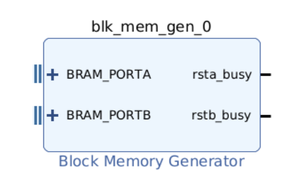
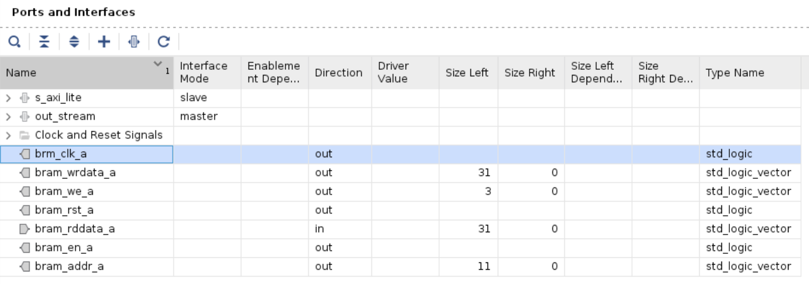
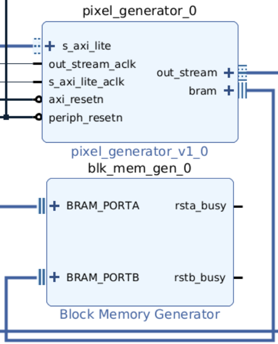
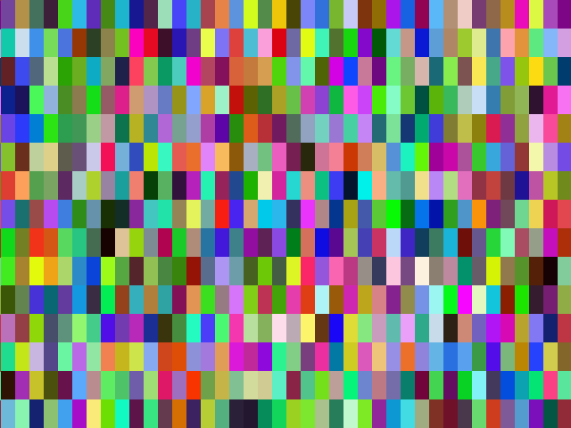

# Adding BRAM to your image generator

The example image generator includes an 8-word register file that can be accessed as signals within your Verilog code and as a memory-mapped IO (MMIO) object in Python. Some applications may require more data, but expanding the register file uses a lot of logic resources because this type of memory is implemented using flip-flops in the configurable logic. Generally, three types of memory are available to IP blocks in a SoC:

| Memory Implementation | Resource Type | Access latency |
| --------------------- | --------- | ------ |
| MMIO Register File    | Flip-Flops      | All bits can be accessed simultaneously in the logic |
| MMIO BRAM (this guide) | On-chip memory blocks      | Can address one word at a time with one clock latency |
| AXI Master            | External DRAM | Might have to wait many clock cycles, data returned word-by-word in bursts |

So BRAM is a middle option between resource usage and the complexity and time needed to access data. There is about 5 Mbit of block memory on the FPGA, but some of it is used as buffers in other IP blocks, and there's not enough to store an entire image frame (about 7MBit for the default size and colour depth). It could be useful, however, for algorithms that require more input data than the register file can hold, up to a few Mbits.

## Adding BRAM to the Overlay

Adding BRAM storage requires three elements: the block RAM itself, an AXI controller block that will give access to the BRAM from the CPU, and a BRAM interface that will connect the BRAM to the pixel generator.

### BRAM Generator and AXI Interface

A BRAM is added to the block diagram quite simply by placing a 'Block Memory Generator'. By default, the size of the memory is set automatically by the memory map, so the only configuration required is to ensure that two ports are created.



Next, add an 'AXI BRAM Controller', configured with one BRAM interface. Connect the BRAM interface of the controller to one port on the BRAM generator.

The BRAM controller needs connecting to an AXI bus. Edit the AXI Interconnect block `ps7_0_axi_periph` and increment the number of master interfaces by one. Connect the new AXI master port that has appeared on the interconnect to the AXI slave port on the BRAM controller. The AXI ports on both blocks have associated clock and reset signals - connect these to the same signals that are used for the other ports on the interconnect block.

### BRAM Interface to Pixel Generator

The pixel generator block requires a new interface to connect it to the BRAM. Expand the BRAM port on the BRAM controller to see the signals that make up the interface. They are:

| Signal | Direction | Bit width | Function |
| ------ | --------- | --------- | -------- |
| `bram_addr_a`  | Out | 12*   | Address  |
| `bram_clk_a`   | Out |  1      | Clock    |
| `bram_wrdata_a`   | Out |  32 | Data written to the BRAM |
| `bram_rddata_a`   | In |  32 | Data read from the BRAM |
| `bram_en_a`   | Out |  1 | Global enable |
| `bram_rst_a`   | Out |  1 | Reset |
| `bram_we_a`   | Out |  4 | Write enables for each byte|

Create these same ports in your pixel generator Verilog module. Add some logic that will test the BRAM by using its contents to form an image. For example, you could read the contents directly into the pixel stream, using the MSBs of the x and y pixel coordinate to address the memory:

```verilog
assign bram_addr_a = {x[9:-6],y[8:-6]}; //Concatenate MSBs of x and y coordinate to form address
assign bram_clk_a = out_stream_aclk;
assign bram_wrdata_a = 0;
assign bram_en_a = 1;
assign bram_rst_a = 0;
assign bram_we_a = 0;

//Use memory contents as output pixel
assign r = bram_rddata_a[7:0];
assign g = bram_rddata_a[15:8];
assign b = bram_rddata_a[23:16];
```

Check the code for errors by choosing 'Run Linter' from the Flow Navigator.

Open the IP packager by clicking 'Edit Packaged IP'. Go to the 'Ports and Interfaces' page and select the option to 'Merge changes from Ports and Interfaces Wizard'. You will see the new ports in the list, but they haven't yet been grouped into an interface:



Click the + icon to add an interface and choose the definition Advanced->bram_rtl. Give it a name that will appear as the interface label on the block diagram. Go to the 'Port Mapping' tab and, for each of the logical ports listed on the left, choose the appropriate physical port from the list on the right and click 'Map Ports'. Click 'OK', then go the 'Review and Package' page and click 'Re-Package IP'.

Go back to the main overlay project and open the block design. Upgrade the IP as usual when you change the Pixel Generator. Connect the new BRAM port on the Pixel Generator block to the spare port on the Block Memory Generator.



Compile the design (generate block design, synthesis, implementation, generate bitstream). Copy the bitstream and hardware handoff file to the Pynq.

## BRAM Interface from Python

Open a Jupyter notebook on the Pynq. First, check that the BRAM has been discovered by the Pynq library:

```python
from pynq import Overlay, PL
overlay = Overlay("/home/xilinx/base_bram.bit")
PL.mem_dict.keys()
```

This lists all the memories in the overlay. Among them should be `axi_bram_ctrl_0`, or whatever the AXI BRAM controller block instance is called in your block diagram. Get its attributes and create an [MMIO interface object](https://pynq.readthedocs.io/en/latest/pynq_libraries/mmio.html) for the BRAM:

```python
from pynq import MMIO
bram_dict = PL.mem_dict['axi_bram_ctrl_0']
bram = MMIO(bram_dict['base_address'],bram_dict['size'])
```

Test the BRAM by writing some data to it and reading it back again:

```python
bram.write(0,bytes("Test",'utf8'))
bram.read(offset=0,length=4).to_bytes(4,'little')
```

These methods have some restrictions:

- The type for writing mut be bytes or int. Here, a string is encoded as bytes using the Python builtin `bytes`
- Data for writing must be a mutliple of four bytes (one word). Reading can only be 1, 2, 4 or 8 bytes
- `MMIO.read()` returns an integer. The result above is converted to bytes with little-endianness.

Now, you can fill the BRAM with random data and check if it is turned into an image by the pixel generator:

```python
from numpy import random
import PIL.Image

rng = random.default_rng()
imgin = rng.integers(0, 255, bram.length, dtype=np.uint8)
bram.write(0,bytes(imgin))

frame = imgen_vdma.readframe()
PIL.Image.fromarray(frame)
```

The result is something like the image below. Note the low resolution due to downsampling (discarding the LSBs) of the pixel coordinates when forming the BRAM address in the Pixel Generator - each memory address is fetched for multiple pixels.



Now you can pass medium-sized blocks of data to your pixel generator to use in any way you choose. You can, of course, also write data to the BRAM from your logic using the `bram_wrdata_a` and `bram_we_a` ports.
