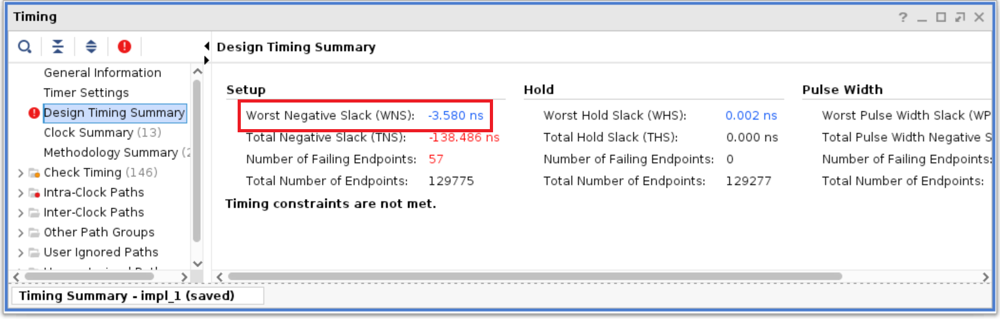
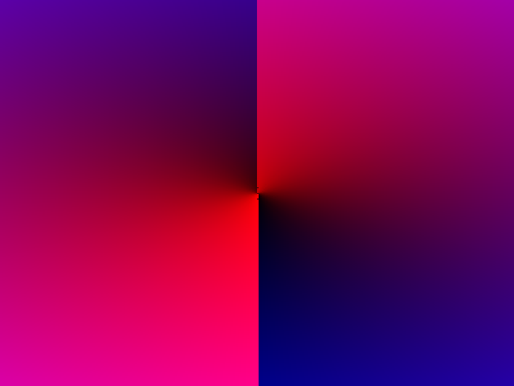
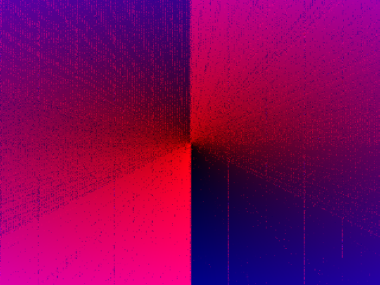
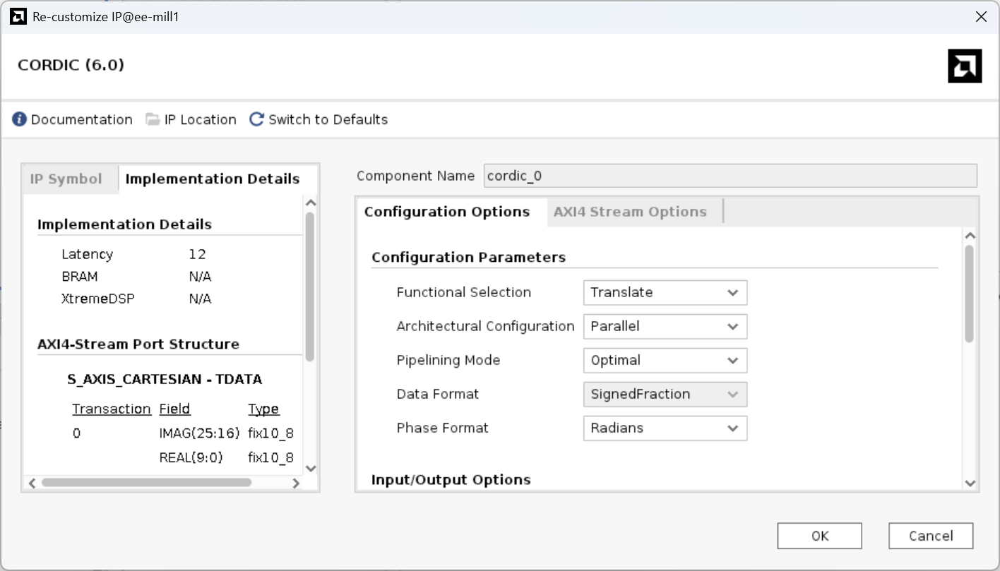
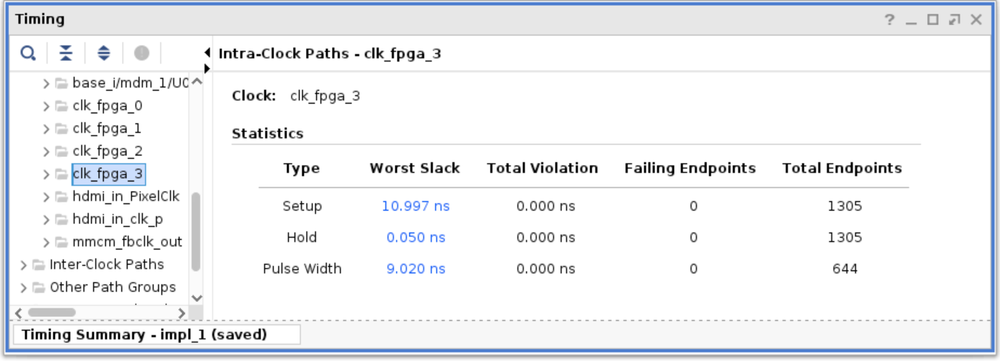
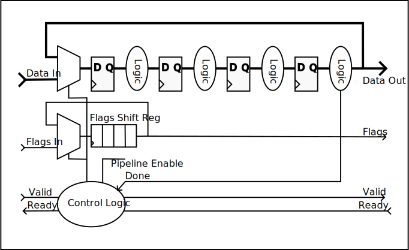

# Diagnosing and Fixing Timing Problems

## Diagnosing Timing Failure

In a digital circuit, a timing fault causes an incorrect value to be latched into a register because the preceding logic gates and wiring have not fully propagated the changes to their inputs following the previous clock edge. The type of error and the consequences, of course, vary hugely depending on the purpose of the register and the data it stores. But in general:

- Timing faults are more likely to occur in arithmetic functions due to long carry chains
- Timing faults will occur for some input combinations/values but not others
- The MSBs of calculations are more likely to be affected
- The contents of the affected register is non-deterministic because the outputs of blocks of complex combinational functions tend to toggle state (glitch) many times before they settle on the correct answer. It is not a simple case of a register storing an old value instead of a new value

In the context of a graphics algorithm, it is more common for timing faults to affect the data path than the control path. That means an image of the correct dimensions may be generated but the contents are incorrect. However, if the algorithm is iterative then the fault may mean the termination condition is never met, in which case the algorithm will not complete.

### Example

You can create a simple pixel generator that nevertheless includes some long propagation delays by instantiating a CORDIC module from the Vivado IP library. Configuring the module in 'translate' mode performs a cartesian to polar conversion, and we can use it to create a circular gradient fill pattern. The CORDIC module has the option to include pipeline registers, but that's disabled for now.

```verilog
wire signed [9:0] x_centre = x - 10'd320;
wire signed [9:0] y_centre = (y << 1) - 10'd480;
wire [31:0] result;
                        
cordic_0 cordic(    .s_axis_cartesian_tdata({6'b0, x_centre >>> 1, 6'b0, y_centre >>> 1}),
                    .m_axis_dout_tdata(result));

assign r = 8'b0;
assign g = result[7:0];
assign b = result[23:16];
```

### Timing Analysis

Vivado analyses the expected timing of a design by summing the propagation delays of every logic element and wire (including clock wiring) in the circuit and comparing them against the requested clock period. The difference is the _slack_ and a negative slack indicates that data may arrive at a register too late for the next rising edge of the clock.

Once compilation is complete, open the implemented design. Straight away, we can see a critical warning in the Messages window informing us of timing violations:

![A message about timing violation: [Timing 38-282] The design failed to meet the timing requirements. Please see the timing summary report for details on the timing violations.](timing-violation.png)

Opening the timing window shows more information. The timing summary shows the worst timing slack of any path in the design (worst negative slack). Another measure, total negative slack, shows the overall magnitude of the problem by summing all the negative slacks at each register, with a total of 57 registers affected:



Opening 'Intra-Clock Paths' shows us that the timing violations are affecting `clk_fpga_3`, which in this design is the clock used for the pixel generator.


We can also see the period of each clock in the 'Clock Summary':


Since the period of the `clk_fpga_3` is 20ns and the WNS is -3.58ns, we can deduce that the maximum clock frequency that would not result in timing violation is $1/(20.0 - (-3.58\text{ ns})) = 42.4 \text{ MHz}$.

> [!NOTE]  
> The original version of the base overlay connects the pixel generator to `clk_fpga_1`, with a frequency of 143 MHz. Under this clock, the WNS would be -16.6ns.

You can find out exactly which registers in your design have timing violations by right-clicking on the affected clock in the report and choosing 'report timing'. The resulting list shows pairs of registers where the propagation delay between them is too great. All the paths shown here start at a register holding part of the pixel coordinates and terminate at the VDMA, which shows that the critical timing path includes the entire computation of the pixel colour and packing it into the output stream.


### Timing Faults

Running the polar gradient design produces this:



This is the expected output. Even though timing violations are reported they are not occurring in practice, or if they are occurring they are not visibly affecting the generated image. Timing analysis is conservative and the worst-case propagation delays that are modelled only occur under rare combinations of inputs, voltage fluctuation, FPGA lifecycle, temperature and manufacturing tolerances.

Using the [API described below](#changing-the-clock-frequency), the clock frequency can be increased to 125MHz. Now the output looks like this:



The impact of the timing faults is now clear. Notice that the distribution of bad pixels has a pattern - this shows how the failing timing paths are only exercised under certain inputs. There can be a huge variations in the time taken to complete a calculation depending on the combination of input bits. Yes, this is rather inefficient, but trying to better (e.g. asynchronous logic) runs into severe practical challenges. Anyway, the performance of modern, large-scale chips tends to be constrained by power rather than clock speed.

## Changing the Clock Frequency

The Pynq processor system has four clock outputs that can be queried and changed dynamically with the Python library:

```python
from pynq import Clocks
Clocks.fclk3_mhz
Clocks.fclk3_mhz = 50.0
```

However, in the original base overlay, the pixel generator is connected to FCLK1 to match the VDMA and other blocks using the same AXI bus. The default frequency is 142MHz, a value that's required to meet the pixel rate for the HDMI output.

In the overlay provided in this and subsequent versions of this repository, clocking has been reorganised so that a dedicated clock, FCLK3, is used for the pixel generator. That allows you to set the clock frequency for your logic freely.

> [!NOTE]  
> The FPGA logic is reset when the clock frequency is changed, so you will need to reinitialise the DMA and maybe other blocks.

> [!NOTE]  
> According to the documentation, the streaming busses connected to a VDMA should not have a clock frequency lower than the memory-mapped bus used to control the VDMA, which is 100MHz in the base overlay. It still seems to work if this condition is violated, but the long-term reliability is not clear.

## Clock Division

A simple way to fix timing failure is to divide the clock so that your logic completes one calculation every two or more clock cycles. There are two ways to achieve it:

1. Create a derived clock like this:

    ```verilog
    reg clk_half;    
    always @posedge(clk) clk_half <= ~clk_half;

    always @posedge(clk_half) begin
        ...
    ```

    A half-frequency clock is shown - for other divisors a counter or state machine would be needed. The counter or state machine should use a Gray Code to ensure there are no glitches (which would cause additional clock edges) as the bits transition.

    The downside of this approach is that the derived clock is created with logic and that introduces some clock skew (delay) relative to the main clock. Data will need to cross between the domains of the two clocks and the skew can cause problems with hold time requirements. The implementation tool _should_ be able to fix it automatically, but you need to check the timing report carefully.

2. Use an enable signal like this:

    ```verilog
    reg clk_en;    
    always @posedge(clk) clk_en <= ~clk_en;

    always @posedge(clk) begin
        if (clk_en) begin
            ...
    ```

    This time, there is no new clock signal so there are no problems with skew. Instead, the registers only latch data every other clock cycle, so the combinational paths between them have two cycles to complete. However, the timing analysis tool cannot automatically determine where this is happening, so the timing violation will still be reported. It is possible to manually add multi-cycle paths between each pair of registers to the timing constraints file.

At the interfaces to your module the clock must remain consistent with the signals defined in the block diagram. Most importantly, the streaming output must remain compatible by ensuring that the valid signal is only high for one cycle of the original clock for each word transferred.

## Pipelining

Pipelining is a method of increasing the maximum clock frequency of a design. Clock frequency is limited by the longest path of combinational logic that exists between one register and another. If an extra register is inserted somewhere along that path, the clock frequency can be increased.

Adding a pipeline register means it now takes one more clock cycle for a calculation to complete, so the _latency_ - the time taken for a calculation to complete - is longer. But the first stage of the pipeline can begin the second calculation while the second stage completes the first, so _throughput_ - the number of calculations per unit time - is improved. The pipelined and non-pipelined versions both complete one calculation per clock cycle, but the clock frequency of the pipelined version is higher.

Since pipelining introduces a latency, you must ensure that data remains synchronised. For example, the following operation adds three numbers to give $y_n = a_n + b_n + c_n$, where $n$ is the clock cycle number:

```verilog
assign y = a + b + c;
```

Adding a pipeline stage would look like this:

```verilog
always @(posedge clk) begin
    intermediate <= a + b;
    c_delayed <= c;
end
assign y = intermediate + c_delayed;
```

The value of `c` goes through a pipeline register as well as the intermediate result, so that `a`, `b` and `c` are synchronised. The result is $y_n = a_{n-1} + b_{n-1} + c_{n-1}$. Without the `c_delayed` register, the calculation would be $y_n = a_{n-1} + b_{n-1} + c_{n}$ and the value of `c` is not synchronised with `a` and `b`.

### Pipelining with a streaming protocol

In the AXI-S video stream protocol, each pixel (or word after the Pixel Packer block) has some associated flags: `tlast` for the last pixel of a line, and `tuser` for the first pixel of a frame. After pipelining, these must remain synchronised to their associated pixels, otherwise the image may become shifted or the VDMA may fail entirely. Furthermore, on initialisation, the pipeline will contain some invalid data that should be flushed out before the first valid result is written to the stream.

In the CORDIC example from above, the IP block can be configured to include pipelining.



Setting the pipelining mode to 'Optimal' and viewing the implementation details shows that the block will have a latency of 12 clock cycles. Now the block will have a clock input and there is also an option for a clock enable, which can be used to stall the pipeline when the rest of the system is not ready. The instantiation looks like this:

```verilog
wire cordic_en = ready | ~cordic_valid
cordic_0 cordic(    .aclk(out_stream_aclk),
                    .aclken(cordic_en),
                    .s_axis_cartesian_tdata({6'b0, x_centre >>> 1, 6'b0, y_centre >>> 1}),
                    .m_axis_dout_tdata(result));
```

The clock connection is straightforward but the enable (`cordic_en`) requires some logic. First, we need to add some shift registers that will pipeline the `tlast`, `tuser` and `valid` signals:

```verilog
reg [11:0] valid_shift = 12'h0, tlast_shift = 12'h0, tuser_shift = 12'h0;

always @(posedge out_stream_aclk) begin
    if (cordic_en) begin
        valid_shift <= {valid_shift[10:0], valid_int};
        tlast_shift <= {tlast_shift[10:0], lastx};
        tuser_shift <= {tuser_shift[10:0], first};
    end
end

wire cordic_valid = valid_shift[11];
wire cordic_tlast = tlast_shift[11];
wire cordic_tuser = tuser_shift[11];
```

Each shift register has 12 bits, the same as the latency of the CORDIC module. The same enable signal as the CORDIC block is used. That means, if some pixel coordinates are fed into the CORDIC algorithm, when the result emerges it will be synchronised with the flags for that pixel, which are at the output of their shift registers.

There is also a shift register for the `valid` signal. In this code, the input pixel coordinates are always valid so the input to this shift register (`valid_int`) is just 1. But when the logic is first initialised the contents of the CORDIC pipeline are not valid, so this shift register is initialised to zeros. Only after 12 clock cycles (with enable true) will the first valid output emerge from the CORDIC block and the output of the shift register become true.

At startup, we need to automatically flush the pipeline to get the first valid output to the streaming interface and this explains the enable logic `cordic_en = ready | ~cordic_valid`. The pipeline will advance if the streaming interface is ready for data, or if the pipeline output is not valid. That creates three cases for the interaction of the pipeline and the streaming interface:

| `ready` | `cordic_valid` | `cordic_en` | Outcome |
| ------- | -------------- | ----------- | ------- |
| True    | True           | True        | The current pipeline output is transmitted to stream receiver and the pipeline advances |
| False   | True           | False       | The pipeline stalls because the output is valid but the stream receiver is not ready for it |
| Don't Care | False       | True        | The pipeline advances to flush the invalid output. No streaming transfer takes place because the output is not valid|

> [!NOTE]  
> The CORDIC IP block can be configured to implement the streaming protocol internally. The `tlast`, `tuser` and `valid` signals can be entrained with the data and the block can automatically flush invalid data (blocking mode). All this logic is implemented externally to the module here to show how it would work in the general case.

Compiling the pipelined version shows that the timing slack is now over 10ns, indicating that the Pixel Generator can run at over 100MHz, ignoring the potential for overclocking.



### Loop Pipelining

The CORDIC-based pixel generator is simple to pipeline because it is feed-forward with a fixed latency; each pixel coordinate enters the pipeline and 12 clock edges later, the result emerges. At any instant, 12 calculations are in progress, each at a different stage of the pipeline.

Pipelining an iterative algorithm is more complex because each calculation must pass through the pipeline multiple times. The output of the pipeline is fed back to the input via a multiplexer to allow the initial values for future calculations to be inserted. When each calculation reaches its terminating condition, the result is output and the multiplexer used to load in the next input and reset any internal counters or state.

The diagram below shows the general layout of a loop-pipelined algorithm. As before, control logic should be used to stall the pipeline if there is data ready for output but the receiver is not ready. A shift register is used to store the flags associated with each calculation, and this is also looped back via a multiplexer. Valid and ready signals go in both directions to ensure data is correctly transferred in and out.



Some iterative algorithms do not run for a fixed number of loops, which means that some calculations in the pipeline may finish before others that started earlier. The ordering of data must be preserved in a streaming architecture, so some extra control logic may be needed to ensure data does not get mixed up. A counter could be used to indicate which of the pipeline slots or threads should be output next. Calculations that finish early may be required to continue looping until the stream is ready for them, or they could be placed into FIFO buffers (one per thread) so that the pipeline can be freed up to make a start on the next problem.
