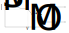
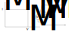

# Smart Grid

## Requirements

1. The system shall provide energy to load LEDs to satisfy the demands given by a third-party web server.
2. The system shall extract energy from a bench power supply (PSU) set up to emulate the voltage-current characteristic of a PV array.
    1. The configuration of the PSU shall be determined by characterising a supplied PV array
    2. The current and/or voltage of the PSU shall be manually modulated to emulate the effect of the day/night cycle
    3. The system shall use a switch-mode power supply (SMPS) with variable duty cycle to maximise the energy extracted from the emulated PV array
3. The system shall store excess energy in a provided supercapacitor for use at a later time
    1. No batteries shall be used
4. A mismatch between supply and demand of power shall be accommodated by importing from or exporting to an external grid, which is emulated by a PSU with an energy sink.
    1. The energy imported or exported shall be metered and converted to a monetary value using variable prices specified by a third-party web server
5. The system shall minimise the overall cost of importing energy with an algorithm to decide when to store/release and import/export energy. It shall also choose when to satisfy demands that can be deferred
    1. The algorithm should perform better than a naive algorithm that always acts to minimise the amount of power imported or exported at a given moment, and delivers demands as soon as they are requested.
6. There shall be a user interface that displays current and historic information about energy flows and stores in the system.

## Resources Provided

### Hardware Kit

Your starter kit contains:

| Qty. | Item |
| ---- | ---- |
| 3    | Bidirectional Buck/Boost SMPS Module |
| 3    | Buck SMPS Module - Configured as LED Driver |
| 3    | Power LED Module |
| 1    | PV Array with 4 cells and connection block |
| 2    | Clamp Multimeter |
| 2    | Busbar |
| 1    | Load Resistor Module |
| 2    | 0.25F Supercapacitor |

### Software

Starter code for the Bidirectional SMPS modules is based on the Power Electronics and Power Systems lab. [A skeleton code for the LED driver SMPSs is provided](#appendix---circuit-specifications).

### The Web Server

An external webserver provides information about demands and externalities that you need to meet the project requirements. In particular, you can look up:

1. The instantaneous demand that you need to satisfy. This represents the sum of all applications that are required immediately by the user, such as boiling a kettle
2. A list of deferrable demands, which can be satisfied at any time in a specified time period. These represent time-flexible applications such as charging an electric vehicle
3. The import (sell) and export (buy) cost for energy. The export price is paid to users for energy that they export
4. The sun irradiance, represented as a fraction of the maximum current setting to be used for the PSU that emulates the PV input
5. A history of the irradiance, demand and price from the previous cycle.

The values returned by the webserver change every 5 seconds (tick). They are computed by summing a periodic component, which follows a repeating 5-minute cycle, with a randomised component. Each cycle approximates the characteristics of a day in real life. Data is returned in JSON format and the code used to generate the webserver output is provided for reference.

The webserver is available at [https://icelec50015.azurewebsites.net/](https://icelec50015.azurewebsites.net/). There are various URIs that return JSON objects, all linked from the index page. The webserver code can be seen in its [GitHub repository](https://github.com/edstott/ICelec50015).

### Project Budget

A budget is available for you to purchase additional items, but it should be possible to complete the project with the equipment provided.

## Getting Started

Try the following steps to get started with the project:

1. Gather some initial data from the PV array by connecting it to a rheostat load. You may ask the lab technicians to borrow a rheostat to make measurements outdoors.
2. Set up the information network with a basic UI that displays some measurements from a database. Set up an SMPS module to log data to the database via WiFi. Set up a mechanism for adjusting the output voltage of an SMPS via the UI.
3. Gather samples of the randomised daily cycle by downloading data from the external server. Research techniques that could be used to optimise energy cost, considering both heuristic approaches (based on specific rules) and more general approaches based on modelling.
4. Consider potential layouts for the energy grid, in particular how the SMPS modules could be configured to balance the energy flows and maintain a constant bus voltage.

## Technical Guide

This section contains advice on the following sections:

1. [Grid Configuration](#grid-configuration)
2. [Robot Function](#robot-function)
3. [PV Array](#pv-array)
4. [Energy Import and Export](#energy-import-and-export)
5. [Flywheel](#flywheel)

### Grid Configuration

Your system should use a central DC grid (or bus) with a constant voltage.
The load LEDs will draw from power from this bus as required, and your energy sources should supply power to maintain the bus voltage at the desired level.
The physical bus can be implemented simply by connecting modules to the provided busbar module with 4mm test leads.

SMPS modules are bidirectional, meaning that current and power can flow in either direction through the module.
However, energy transfer requires a higher voltage at Port A (left side) than Port B (right side).
The photovoltaic arrays output a variable voltage depending on the irradiance from sunlight and the voltage of the supercapacitor varies with the stored charge.
Therefore, choose a bus voltage to ensure that every SMPS module will always satisfy Va > Vb.

Each SMPS module can be used in different modes:

1. Attempt to set the voltage on Port A or Port B to a defined level (constant voltage mode)
2. Attempt to pass a certain amount of current input or output through Port B (constant current mode). This can also be used as a constant power mode by dividing the required power by the voltage on Port B.
3. Attempt to maximise the power flow through the module with maximum power point tracking (see [below](#pv-array))

You will need to choose how to configure your modules to meet the project requirements.

#### Data Connectivity

You will need to communicate with your SMPS modules to control them and monitor the system.
Each SMPS (bidirectional or buck) uses a Raspberry Pi Pico with WiFi capability, so you can connect them to an external server or database using the provided libraries.
You may need to use a mobile hotspot to provide a WiFi network because the College WiFi network is difficult to access for embedded devices.

### PV Array

The PV Array has 4 PV cells on an inclined stand.
The PV cells should be wired in parallel so that the total voltage doesn't exceed the limit of the SMPS modules.
The voltage of PV cells varies with the level of irradiance and inversely with the current flow.
Since power is the product of voltage and current, there exists a point where power output is maximum for a given irradiance.
You need to draw current from the array to extract power, but too much current will reduce the voltage to the point where power reduces.

The first step to optimal use of the PV array is to characterise its I-V (current-voltage) curve. This will need to be completed outside but can be achieved even in overcast conditions.
Place the PV array in a location with consistent irradiance and connect it to a rheostat.
Then, sweep the resistance of the rheostat and log the input voltage and current by measuring them multimeters.
Find the duty cycle which results in maximum power and you have found the most efficient operating point for the PV array. The cell has an open-circuit voltage $V_O$, a short-circuit current $I_S$, and a point ($V_M$, $I_M$) where power is maximal.

|  |
|:--:|
| _Typical I-V characteristic of a PV cell_ | 

Unfortunately, this operating point varies with irradiance and temperature, so you cannot simply configure an SMPS to maintain a constant voltage or current to achieve an optimal output.
Instead, you need to implement _maximum power point tracking_ to alter voltage and current according to conditions.
Typically, the controller makes constant adjustments to duty cycle and measures the input power.
If an adjustment results in increased power, it is kept, otherwise it is reversed.

The PV array does not work well under artificial lighting, so you will need to set up a bench PSU in the lab to mimic the PV array under outdoor conditions.
The simplest approach is to set the voltage and current limits to the values you observed when the array produced maximal power.

|  |
|:--:|
| _A bench power supply automatically switches between constant voltage mode and constant current mode such that the voltage limit and the current limit are not exceeded. This results in a rectangular I-V characteristic_ |

You can also add series and parallel resistances to make the I-V function more realistic.

Series and parallel resistances add slopes to the I-V characteristic, which can make more realistic test conditions for an MPPT algorithm.
Here, $I_M=I_S-(V_O/R_P)$ and $V_M=V_O-I_M R_S$.
If you implement this PV emulator, make sure you calculate the maximum power dissipation for each resistor and use resistors with an appropriate power rating.

### Energy Import and Export

The system includes a connection to an external power grid that can be used to supply energy if there is insufficient generation or storage.
It can also be used to sell surplus energy.

The external grid can be emulated with a bench power supply set at a constant voltage that can be converted up or down to your bus voltage with an SMPS.
If you attempt to drive current into a bench power supply the current will drop to zero and the terminal voltage will rise, so connect a resistor in parallel with the PSU to sink any reverse current. The resistor should be small enough that you can sink the maximum foreseeable export current through it without exceeding 15V.

The external grid connection is a reliable power source and sink, so it can be interfaced with your bus with a SMPS in constant voltage mode to regulate the bus voltage.
However, this technique could make it harder to precisely control the amount of energy import and export.
An alternative would be to use constant current mode to set the power import or export according to your forecasting algorithm, but you need to ensure that this does not cause the bus voltage to vary too much.

The SMPS module that you use to connect the external grid to your bus should be configured to measure current so that you can calculate the cost of imported energy and the income from exported energy.

### Supercapacitor

Your kit contains 2 supercapacitors rated at 0.25F and 18V each, which will store around 50J of energy in total when charged to the maximum SMPS voltage. Like a standard capacitor, they store energy as an electric charge according to the formula $E=CV^2$. That means, unlike a battery, you can accurately determine the amount of energy stored by measuring the terminal voltage, subject to the complications discussed below. Ensure that you do not exceed the voltage rating of the capacitor because it will break down and be destroyed.

The standard capacitors you've used in labs have close to ideal behaviour at low frequencies, but the supercapacitor has higher parasitic resistance. Furthermore, the resistance is distributed across the area of the capacitor plates and this means the localised charge stored in different parts of the capacitor can be temporarily imbalanced. This has a few consequences:

- If you apply a large charging current to the capacitor terminals the voltage will rise. But when you stop the current you will observe the voltage fall again as the charge stored near the terminals balances out across the capacitor plates
- If you short the capacitor terminals out or draw a large discharging current, the terminal voltage will drop to zero. But the capacitor might not be fully discharged as it takes time for the charge to move through the capacitor
- Passing charge through the internal resistance of the capacitor wastes energy, so you will not be able to recover all the energy you store in the capacitor

Take time to experiment with the capacitor and confirm that you take account of the internal resistance when you integrate it into your system.

## Appendix - Circuit Specifications

### Lab SMPS

[Schematic of the Lab SMPS](doc/Lab_SMPS_SCM.pdf)

[Example code for Lab SMPS](SMPS_2024_Bidirectional.py)  - Be aware that closed loop mode may not be stable, it was not tuned for your system

| Specification | Value | Unit |
| ------------- | ----- | ---- |
| Circuit Type | Buck or Boost | |
| Current Sensing | Bidirectional at Port B positive line | |
| Controller Type | Raspberry Pi Pico | |
| Controller Power Source | USB, Port A* or Port B* | |
| Base Code | SMPS_Bidirectional.py | |
| PWM Frequency | 100 | kHz |
| Port A Voltage* | 0 - 17.5 | V |
| Port B Voltage* | 0 - 17.5 | V |
| Max Current | 5 | A |

*The Buck/Boost switch determines which port is used to power all the support circuitry on the board (Pico, Current Sensor, MOSFET drivers etc.), this port has a minimum voltage of 6-7V for this function. If the switch is set to Buck then Port A must meet the minimum voltage, if its set to Boost then Port B must meet the minimum voltage.

### LED Driver SMPS

[Schematic of the LED Driver](doc/LED_Driver_SCM.pdf)

[Example code for LED Driver - This will cycle through different current references for a closed loop current controller](LED_Driver_Example.py)

| Specification | Value | Unit |
| ------------- | ----- | ---- |
| Circuit Type | Buck or Boost | |
| Current Sensing | Unidirectional at output negative line | |
| Controller Type | Raspberry Pi Pico | |
| Controller Power Source | USB or Input Port | |
| Base Code | LED_Driver.py | |
| PWM Frequency | 100 | kHz |
| Input Voltage | 7 - 17.5 | V |
| Output Voltage | 0 - 17.5 | V |
| Max Current | ~500 | mA |

### LED Loads

| Specification | Value | Unit |
| ------------- | ----- | ---- |
| Power Rating | 1 | W |
| Voltage Drop (varies with colour) | ~3 | V |
| Current Rating (also varies with colour) | ~300 | mA |

### PV Panels

[Datasheet for PV Panel](https://static.rapidonline.com/pdf/502676_v1.pdf)

| Specification | Value | Unit |
| ------------- | ----- | ---- |
| VOC | 5 | V |
| ISC | 230 | mA |

### Supercapacitor

[Datasheet for Supercapacitor](https://www.mouser.co.uk/ProductDetail/Cornell-Dubilier-CDE/DSM254Q018W075PB?qs=rQFj71Wb1eXTUSitfenP%2Fw%3D%3D)

| Specification | Value | Unit |
| ------------- | ----- | ---- |
| Max Voltage | 18 | V |
| Capacitance | 0.25 | F |
| ESR | ~4 | Ohms |
| Current Limit (5s Peak) | 350 | mA | 
